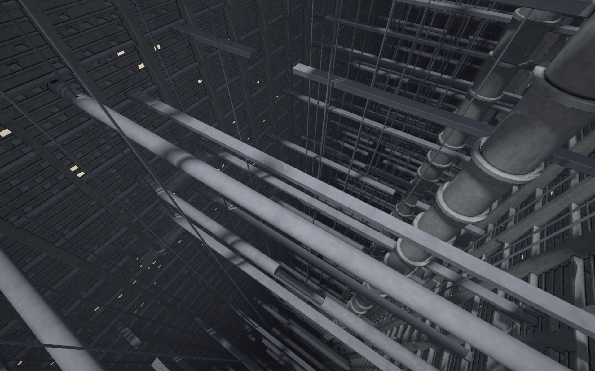
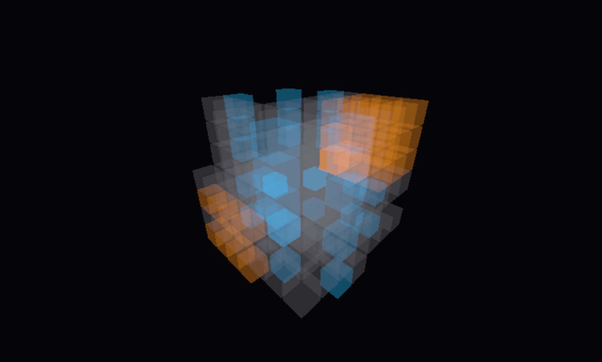
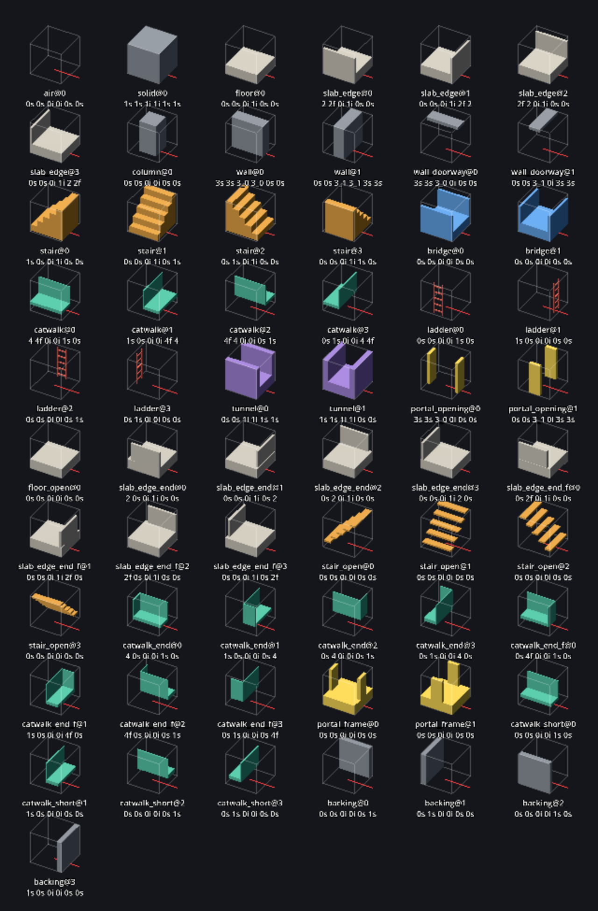
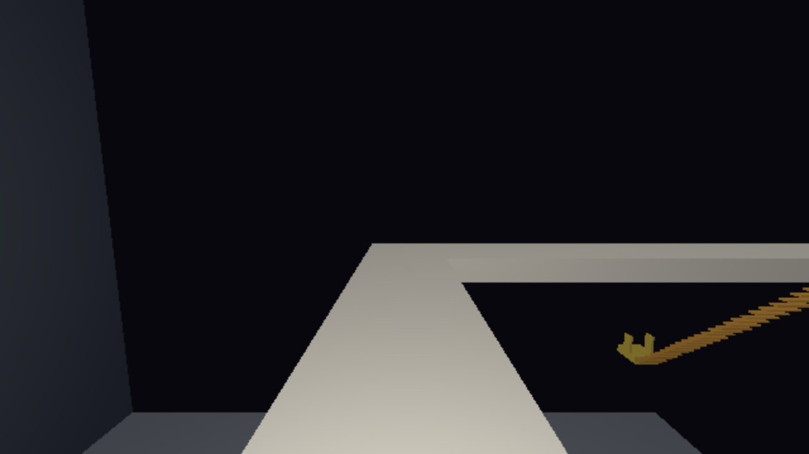

# megastructure



A generative, explorable rendering of a Blame!-style megastructure in Godot 4:
endless strata, vertical shafts, and open chasms between stratified facades.
No gameplay, just a world that generates itself from a seed.

The current milestone (0.1.0) ports the ray-marched chasm prototype into a
fullscreen shader with a free-fly camera and a live tweak panel. See
[`docs/PLAN_0.1.0.md`](docs/PLAN_0.1.0.md).

## Setup

The Godot version and every build task are managed with
[mise](https://mise.jdx.dev/). Install mise, then from the repository root:

```sh
mise install
```

This downloads the pinned Godot build (see `mise.toml`) and the other tools.

To export a build, install the matching export templates once, then export a
preset from `export_presets.cfg`:

```sh
mise run templates
mise run export linux build/linux/megastructure.x86_64
mise run export macos build/macos/megastructure.zip
```

Every [GitHub release](https://github.com/seletz/megastructure/releases) has a
Linux (x86_64) and a macOS (universal) build attached. The macOS build is not
signed or notarized: on first launch, right-click the app and choose Open to
get past Gatekeeper.

## Skeleton viewer



The generative world starts with a skeleton: a lattice of 48 m sectors, each
given a type by a hashed grammar so the same seed always produces the same
layout. The viewer draws that lattice around a free-fly camera:

```sh
mise run run-skeleton
```

Grey is solid mass, cyan a shaft, orange a cavity, red a chasm, and the faint
wireframes are strata, the habitable layers that make up most of the world.
The sector you are in is never drawn. Tab opens the panel with the viewer
settings (radius, fill, stratum) and every grammar parameter, so the structure
can be tuned live; `mise run skeleton-stats` checks a tuning against the
acceptance rules. How the grammar works is described in
[`docs/algorithms/sector-skeleton-and-walkable-graph.md`](docs/algorithms/sector-skeleton-and-walkable-graph.md).

### Placeholder tileset



Sectors will be filled with 2 m tiles by a wave function collapse solver.
Until real meshes exist it uses a placeholder tileset of boxes at the
concept's proportions: air, solid, floor slab, slab edge with parapet,
column, wall, doorway, stair, bridge, catwalk, ladder, tunnel and portal
opening. The contact sheet above shows every rotation of every tile with the
six socket strings that decide what may sit next to it. The tileset is
generated from code and validated with:

```sh
mise run tileset-build
mise run tiles-check-placeholder
mise run shot scenes/tile_contact_sheet.tscn docs/images/placeholder-tileset.png --resolution 1280x1080
```

The tiles and their sockets are described in
[`docs/code/tileset.md`](docs/code/tileset.md).

### First walkable sector



The solver's output can now be walked. The walk scene solves the 27 sectors
around the origin on worker threads and places each one as a Godot
`GridMap` as soon as it is done, with collision generated from the tile
meshes. A sector the solver could not fill shows up as a translucent red
box. A capsule drops onto the first sector that solved:

```sh
mise run run-walk
```

WASD walks relative to the view, Space jumps, Shift runs, Esc captures the
mouse, V switches between first and third person, and F switches to the
free-fly camera and back (the capsule lands where the camera is). At seed 0
on the placeholder tileset 11 of the 27 sectors solve; the rest wait on
[#161](https://github.com/seletz/megastructure/issues/161). `mise run
walk-check` walks the capsule over stairs and landings, and `mise run
walk-check --sector x,y,z` tries a real sector portal to portal. How it
works is in [`docs/code/placement.md`](docs/code/placement.md).

The world streams as you walk. Only the sectors within one sector of yours
are loaded (up to three with `radius` in the Tab panel); a sector is freed
once it is two away, so walking along a boundary does not load and free the
same sectors again and again. Sectors you walked through are remembered,
so walking back places them without solving. Each sector's collision is
added in small pieces over several frames, those under your feet first, so
the frame rate holds while the world loads; if you outrun the loading, the
capsule waits at the edge. Translucent boxes in the skeleton viewer's
colours stand in for the sectors just beyond. `mise run streaming-check`
walks ten sectors and back and checks there is never a hole underfoot,
memory returns to where it started and no frame takes over 33 ms; the
details are in
[`docs/algorithms/sector-streaming.md`](docs/algorithms/sector-streaming.md).

## Controls

| Key              | Action                                               |
| ---------------- | ---------------------------------------------------- |
| Tab              | Open or close the tweak panel (frees the mouse)      |
| H (or F1)        | Show or hide the HUD; a small hint stays when hidden |
| P (or F12)       | Save a screenshot without HUD and panel              |
| R                | Pick a random seed                                   |
| Esc              | Capture or release the mouse for looking around      |
| Right mouse drag | Look around                                          |
| W / A / S / D    | Fly forward / left / back / right                    |
| Q / E            | Fly down / up                                        |
| Shift            | Fly fast                                             |
| Mouse wheel      | Scale the flying speed                               |

The single-key shortcuts and the movement keys are ignored while a text field
in the panel has focus. Screenshots land in
`user://screenshots/<seed>_<yyyymmdd-hhmmss>.png`; the absolute path is printed
to the console.

## Tasks

| Task                 | What it does                                             |
| -------------------- | -------------------------------------------------------- |
| `mise run editor`    | Open the project in the Godot editor                     |
| `mise run run`       | Run the project (main scene)                             |
| `mise run check`     | Import, parse all scripts, verify the project loads (CI) |
| `mise run check-scripts` | Parse every `.gd` file and fail on errors            |
| `mise run import`    | Import all assets headlessly (regenerates `.godot/`)     |
| `mise run templates` | Download export templates for the pinned Godot version   |
| `mise run export`    | Export a release build: `mise run export <preset> <out>` |
| `mise run export-debug` | Export a debug build, same arguments                  |
| `mise run clean`     | Remove the import cache and build output                 |
| `mise run hash-vectors` | Print the shared hash reference vectors               |
| `mise run release:release` | Tag and publish the version in `project.godot`, then bump `develop` (`--dry-run` to preview) |
| `mise run release:bump` | Raise the version: `mise run release:bump <patch\|minor\|major>` |
| `mise run release:notes` | Print the changelog section of the next release       |

`mise tasks` lists everything with descriptions.

## Design wiki

`docs/` is a design wiki and opens as an [Obsidian](https://obsidian.md/)
vault: open the `docs/` folder with "Open folder as vault". Start at
[`docs/Home.md`](docs/Home.md), the map of content; how notes are written is in
[`docs/CONVENTIONS.md`](docs/CONVENTIONS.md). The files are plain Markdown and
also read fine on GitHub.
What changed in each version is in [`docs/CHANGELOG.md`](docs/CHANGELOG.md);
how a version is released is in
[`docs/process/releasing.md`](docs/process/releasing.md).

## Documentation

- [`docs/MEGASTRUCTURE_CONCEPT.md`](docs/MEGASTRUCTURE_CONCEPT.md): design
  goals, the three-layer generation architecture, tile vocabulary, look and
  lighting, and the long-term milestones.
- [`docs/PLAN_0.2.0.md`](docs/PLAN_0.2.0.md): the plan for the current
  milestone, the generative world.
- [`docs/PLAN_0.1.0.md`](docs/PLAN_0.1.0.md): the plan for the first
  milestone, with links to the GitHub epics.
- Prototypes: two self-contained ray-marched HTML pages that define the look.
  Open them directly in a browser.
  - [`docs/megastructure.html`](docs/megastructure.html): interior strata,
    shafts and cavities.
  - [`docs/megastructure-chasm.html`](docs/megastructure-chasm.html):
    exterior chasm between facades, the reference for milestone 0.1.0.
- [`docs/hash_vectors.md`](docs/hash_vectors.md): the shared integer hash
  used by the shader, GDScript and the prototypes, with reference vectors.

## Contributing

Branching, commit and pull request rules are in
[`CONTRIBUTING.md`](CONTRIBUTING.md).

## Editing

GDScript files use tabs. A Zed configuration for the Godot language server is
included under `.zed/`.

- [`docs/RESEARCH_WFC.md`](docs/RESEARCH_WFC.md): research for milestone 0.2.0,
  the WFC / model synthesis sector fill in Godot, with a proposed issue
  breakdown.
