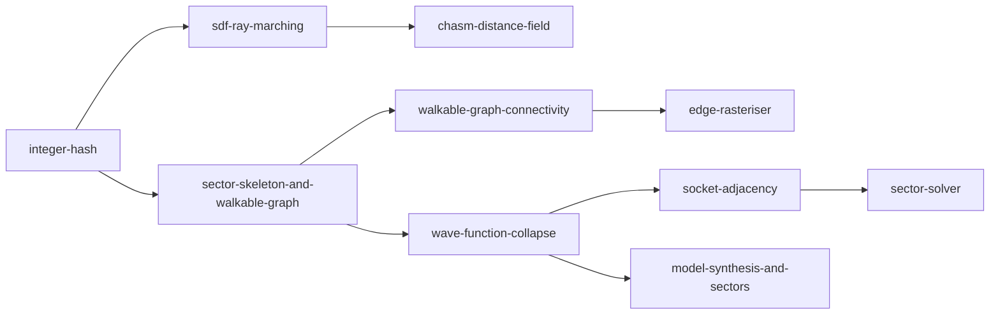

---
tags:
  - algorithm
  - moc
status: current
---

# Algorithm Notes

> [!summary]
> One note per algorithm the project uses or plans to use, each readable in
> about five minutes: a plain-language summary, a worked example or diagram,
> the details, open questions, and links to the papers and code behind it.
> The first three describe code that exists in milestone 0.1.0 (the hash and
> the ray-marched chasm). The other four describe the tile-based generator
> planned for milestone 0.2.0 and follow the recommendations in
> [[RESEARCH_WFC]]. Unfamiliar terms are defined in [[GLOSSARY]].

## Suggested reading order

Start with the hash: everything else draws its decisions from it. Then
either follow the renderer (left) or the generator (right).

## Notes

### Implemented (milestone 0.1.0)

| Note | What it covers |
| --- | --- |
| [[integer-hash]] | Why the float hash was replaced, the PCG mixer, the 24-bit float, salts and cells, the reference vectors task. |
| [[sdf-ray-marching]] | Distance fields, sphere tracing, why every term must be a lower bound, the bounds we tightened, normals, AO and soft shadows, and why this renderer is a throwaway. |
| [[chasm-distance-field]] | How facades, openings, pillars, bridges and cables are built from hashed cells, with every cell size and salt. |

### Planned (milestone 0.2.0)

| Note | What it covers |
| --- | --- |
| [[wave-function-collapse]] | Simple-tiled WFC with a worked 2D example, cell choice, propagation, contradictions and restarts, determinism from the hash. |
| [[model-synthesis-and-sectors]] | Merrell's block scheme and the face-first, order-independent sector boundaries that make streaming work. |
| [[socket-adjacency]] | Sockets, symmetry and rotation conventions, rotation expansion and deriving adjacency bitsets, validating a tileset (all implemented). |
| [[sector-skeleton-and-walkable-graph]] | The hashed sector grammar (implemented, with its rules, salts and parameters) and the path graph: portals and interior nodes. Draft. |
| [[walkable-graph-connectivity]] | Edges of the walkable graph (implemented): Kruskal with hashed weights per 3³ region, tunnels through solid, boundary edges between regions, loops, and why region-aligned windows are connected. |
| [[sector-solver]] | The solver core (implemented): bitset wave, AC-3 with byte-sliced tables, minimum remaining values in an indexed heap with a hashed tie-break, integer weighted draws from the hash, and measured times and failure rates. |
| [[edge-rasteriser]] | The fill contract (implemented): each sector's edges as walks of tile family records from the hub to the portals, explicit stair runs and ladders at every level change, and the merge rule that keeps records from conflicting. |

## Related

- [[hash_vectors]]: the hash definition and its reference values.
- [[MEGASTRUCTURE_CONCEPT]]: the three-layer architecture these algorithms
  implement.
- [[PLAN_0.1.0]] and [[RESEARCH_WFC]]: where the decisions behind these notes
  were taken or proposed.
- Paper notes are being collected in `papers/` (issue #57); the notes here
  name their sources in plain text until those exist.
