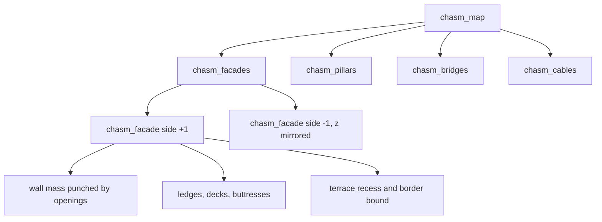

---
tags:
  - algorithm
  - rendering
  - sdf
  - chasm
status: current
---

# Chasm Distance Field

> [!summary]
> The chasm of milestone 0.0.1 is a canyon 280 m wide between two stratified
> facades, with free-standing pillars, bridges and hanging cables in the void.
> All of it is one distance function built from a handful of repeating
> patterns: ledges every stratum, decks every 30 m, buttresses every 40 m. The
> variety comes from chopping space into cells of different sizes and letting
> the [[integer-hash]] decide, per cell, whether a feature is there, how deep a
> terrace is recessed, where a pillar stands. This note walks through each
> part with its cell size and hash salts, so a reader can find any feature in
> the code and knows which knob changes it.

## Coordinates and structure

- `x` runs along the chasm, `y` is up, `z` goes across.
- The two facades face each other at `|z| = chasm_half_width` (140 m), pushed
  back further where a terrace is recessed. Everything with `|z|` smaller is
  void, until a pillar, bridge or cable fills it.
- The second facade is the first one mirrored in `z`. Each facade passes
  `side = +1` or `-1` into the spare coordinate of its hash cells, so the two
  walls make independent decisions.



`chasm_map` takes the minimum of the four parts and remembers the material of
whichever is closest: concrete for facades and pillars, metal for bridges and
cables, and an emissive "lit" material inside a few openings.

## The facade

All sizes are the uniform defaults in
[chasm.gdshaderinc](../../shaders/include/chasm.gdshaderinc), in metres. The
worked picture below is a cross-section through one facade, looking along
`x`:

```
        void (z towards the chasm centre)         wall mass
                                                 |
   deck (every 30 m)  ============================|  4.4 deep, 1.4 tall
                                                 |
   ledge (every 6 m)                      =======|  1.2 deep, 0.44 tall
                                               [ |  opening: 5.2 x 3.4,
                                               [ |  7 deep behind the plane
   ledge                                  =======|
                                                 |
   buttress (every 40 m along x)  ###############|  3.6 wide, 10 deep
```

### Repeating features (no hash)

These are pure domain repetition: the point's height or `x` is folded with
`mod` into one period and a profile is evaluated there.

| Feature | Period | Size | Uniforms |
| --- | --- | --- | --- |
| ledge | 6 m in y (`stratum_height`) | 1.2 deep, 0.44 tall | `ledge_*` |
| deck | 30 m in y | 4.4 deep, 1.4 tall | `deck_*` |
| buttress | 40 m in x | 3.6 wide, 10 deep | `buttress_*` |

Each is a rectangle profile attached to the wall plane (`chasm_profile`),
extruded infinitely along the direction it runs.

### Hashed facade decisions

| Decision | Cell (size, key) | Salt | Rule (defaults) |
| --- | --- | ---: | --- |
| terrace recessed? | 60 × 60 m in x, y; `(tx, ty, side)` | 3 | hash < 0.32 |
| terrace depth | same cell | 5 | 6 to 20 m |
| buttress removed? | 40 × 120 m in x, y; `(bx, by, side)` | 7 | hash < 0.25 |
| opening present? | 8 × 6 m in x, y; `(ox, oy, side)` | 11 | hash ≥ 0.5 |
| opening lit? | same cell, same hash | 11 | hash > 0.955 |

- **Terraces** move the whole wall plane, with its ledges, decks, buttresses
  and openings, back into the rock by the recess depth. Where a recessed cell
  meets a less recessed one, the neighbour's wall reaches right up to the
  border; `chasm_terrace_border` accounts for that (see
  [[sdf-ray-marching#The bounds we tightened]]).
- **Openings** are boxes subtracted from the wall mass only. Ledges and decks
  never reach behind the wall plane, so punching the wall alone carves the
  same solid as punching everything. One opening cell is one stratum tall, so
  there is at most one opening per stratum per 8 m of wall. Lit openings reuse
  the presence hash: the top 4.5 % of present openings are lit, and the tint
  is applied only more than 20 cm inside the hole.
- **Buttress removal** is decided per 40 × 120 m cell. With the defaults the
  cell borders run along buttress centrelines, so a removed cell can leave
  half a buttress standing in its neighbour, which is what gives the ragged,
  broken look.

## Pillars

| Decision | Cell | Salt | Rule (defaults) |
| --- | --- | ---: | --- |
| pillar present? | 110 m in x; `(id, 0, 0)` | 21 | hash < 0.55 |
| radius | same | 22 | 4 to 12 m |
| x offset in cell | same | 23 | keeps the pillar 3 m inside its cell |
| z offset | same | 24 | keeps the pillar 20 m off both facades |

A pillar is an infinite vertical cylinder with a ring at every deck level,
2.5 m wider and 1.6 m tall, aligned with the facade decks so the rings read
as the same structure. There is at most one pillar per 110 m of chasm, and
the cells are one-dimensional: the decision does not depend on height.

## Bridges

| Decision | Cell | Salt | Rule (defaults) |
| --- | --- | ---: | --- |
| bridge present? | 90 × 40 m in x, y; `(bx, by, 0)` | 31 | hash < 0.5 |
| x and y offset | same | 32, 33 | clamped so the bridge stays inside its cell |
| tube or slab | same | 34 | tube if hash > 0.7 |
| broken? | same | 35 | hash < 0.4 |
| gap position along z | same | 36 | anywhere 30 m clear of the facades |
| gap length | same | 37 | 16 to 44 m |

Bridges span the chasm along `z`. A slab bridge is a 6 × 2.8 m box whose ends
reach 30 m into the facades; a tube has radius 3.5 m and runs on through the
rock. A broken bridge has a slab of `z` cut out of it. The prototype cut a
20 × 20 m box instead, which is the same at the default cross sections.

## Cables

| Decision | Cell | Salt | Rule (defaults) |
| --- | --- | ---: | --- |
| cable present? | 25 × 25 m in x, z; `(cx, cz, 0)` | 41 | hash < 0.22 |
| x and z offset | same | 42, 43 | axis stays 1.5 m inside its cell |
| radius | same | 44 | 0.12 to 0.37 m |

Cables hang vertically without end, and are cut off 4 m in front of either
facade so they never pierce the walls.

## Surface salts

Not part of the distance, but drawn from the same hash, and listed here so
the salt table is complete:

| Use | Cell | Salt |
| --- | --- | ---: |
| fine grime | `floor(p * 0.7)`, about 1.4 m | 50 |
| coarse grime | `floor(p * 0.12)`, about 8.3 m | 51 |
| film grain | pixel position and frame number | 60 |

They live in [surface.gdshaderinc](../../shaders/include/surface.gdshaderinc)
and [post.gdshaderinc](../../shaders/include/post.gdshaderinc).

## Why neighbours are checked

Every hashed feature is evaluated in the point's own cell and in the one to
three neighbouring cells towards the nearest border, with every other cell
bounded by the distance to the far border. Hashed offsets are clamped so each
object stays inside its cell. The prototype evaluated only the point's own
cell, which lets rays step through objects in the next cell. The reasoning is
in [[sdf-ray-marching]].

## Open questions

- **Porting to tiles.** Milestone 7 of the concept turns this facade grammar
  into a tileset for the fill layer. Which of these cell sizes survive on a
  2 m voxel grid, and whether pillars and bridges become tiles or stay a
  separate placement pass, is undecided.
- **Parameter ranges.** Several bounds rely on the defaults (cable radii up
  to 1.5 m, pillar rings inside their cell, bridge cross sections that fit
  the cut box). The tweak panel lets a user leave those ranges; the shader
  comments say where, but nothing warns at runtime.
- **Correlated keys.** Pillars, bridges and cables all use `z = 0` in their
  cell keys and differ only by salt band. That is correct for the hash, but
  worth remembering before reusing a salt number.

## References

Related notes: [[sdf-ray-marching]], [[integer-hash]],
[[MEGASTRUCTURE_CONCEPT]] (tile vocabulary, exterior), [[PLAN_0.0.1]].

Code: [chasm.gdshaderinc](../../shaders/include/chasm.gdshaderinc),
[sdf.gdshaderinc](../../shaders/include/sdf.gdshaderinc),
[surface.gdshaderinc](../../shaders/include/surface.gdshaderinc),
[post.gdshaderinc](../../shaders/include/post.gdshaderinc),
[raymarch_world.gdshader](../../shaders/raymarch_world.gdshader), and the
prototype [megastructure-chasm.html](../megastructure-chasm.html) (`facade()`
and `map()`).
