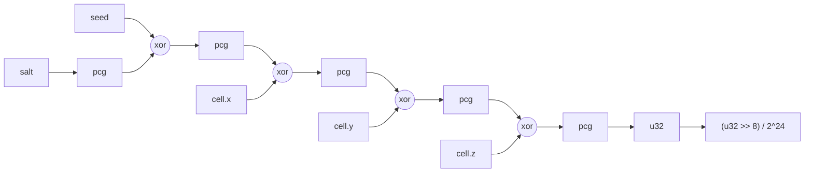

---
tags:
  - algorithm
  - hash
status: current
---

# Integer Hash

> [!summary]
> Every random-looking decision in the world, from "is there a bridge here" to
> "how much grime is on this wall", comes from one small function: it takes
> the world seed, an integer cell position and a salt number, and returns a
> number between 0 and 1. The function uses only 32-bit integer arithmetic,
> so the GPU shader, GDScript and the JavaScript in the HTML prototypes all
> compute exactly the same bits. That is what lets the CPU-side generator of
> later milestones agree with what the ray-marched prototype draws. The note
> explains why the prototypes' original float hash had to go, how the PCG
> mixer works, why only 24 bits become the float, how salts and cells are
> chosen, and how the reference vectors keep the implementations honest.

## Why not the float hash

The HTML prototypes originally used a float hash of the "hash without sine"
family: multiply the cell position by a few odd constants, keep the
fractional part, mix the components, keep the fractional part again. It is
fast and looks fine on screen, but it cannot serve as the backbone of a
deterministic world:

- **Float rounding differs between machines.** GLSL `float` is 32 bits on the
  GPU, GDScript `float` is 64 bits on the CPU. The same expression rounds
  differently, and `fract()` magnifies the difference into a completely
  different value. Even two GPUs may disagree when a driver fuses a multiply
  and an add.
- **Precision runs out far from the origin.** Once the cell coordinate times
  the constant is large, the float has no fractional bits left and the hash
  degrades into stripes or constants. The world is meant to be unbounded.
- **Salts shared the coordinate space.** A decision was separated from
  another by multiplying a salt into one coordinate (`side * 7.0`), so
  unrelated decisions could read overlapping inputs.

Integer arithmetic has none of these problems: unsigned 32-bit
multiplication and xor wrap the same way in every language that offers them.
The decision is recorded in [[PLAN_0.0.1#Decision: shared integer hash]]; the
accepted cost was that the prototypes' layouts changed once for a given seed.

## How the hash is built

The inputs are absorbed one at a time: the salt is scrambled and xored into
the seed, then each coordinate is xored into the running state and the state
is scrambled again. The exact definition, in pseudocode, lives in
[[hash_vectors]].

### The PCG mixer

`pcg(v)` is a single round of the output function of O'Neill's PCG random
number generators, in the form Jarzynski and Olano recommend for GPU hashing:

1. **LCG step:** `s = v * 747796405 + 2891336453`. A multiply by an odd
   constant plus an add; it spreads low bits upwards.
2. **Random xorshift:** `s ^ (s >> k)` where `k = (s >> 28) + 4`, so the top
   four bits of the state choose a shift between 4 and 19. Data-dependent
   shifts break up the regular structure an LCG leaves behind.
3. **Multiply:** by the odd constant `277803737`.
4. **Final xorshift:** `w ^ (w >> 22)` folds the well-mixed high bits back
   into the low bits.

Every step is invertible (odd multipliers, and xorshifts whose shift amount
can be recovered from the untouched top bits), so `pcg` is a permutation of
the 32-bit integers: two different inputs to one round never collide. It is
also cheap: two multiplies, a few shifts, no branches, no tables. Jarzynski and
Olano found this family a good balance of quality and speed among GPU hashes.

### The top 24 bits become the float

`hash3` returns `(u32 >> 8) / 16777216.0`. A 32-bit float stores integers up
to 2^24 exactly, so keeping only the top 24 bits makes the division exact in
float32 as well as in float64. The largest value is `1 - 2^-24`, never `1.0`,
which keeps `mix(a, b, h)` strictly below `b` and `floor(h * n)` below `n`.
Dropping all 32 bits into a float instead would round, differently on CPU
and GPU, and could round up to exactly 1.0.

### Salts and cells

A **cell** is an integer lattice coordinate. Callers divide a position by a
cell size and `floor()` it; all points inside the same cell get the same
value, which is what makes a hashed decision stable across the whole object
it controls. Negative coordinates enter as their two's complement bit
pattern. Two-dimensional decisions pass `z = 0`, or put a discriminator such
as the facade side (`+1` or `-1`) into the spare coordinate.

A **salt** separates independent decisions made on the same cell. "Is there a
bridge in this bridge cell" uses salt 31 and "where along x does it sit" uses
salt 32, so the offset is not correlated with the presence. The chasm uses
salts in bands per feature (3 to 11 for facades, 21 to 24 for pillars, 31 to
37 for bridges, 41 to 44 for cables, 50 and 51 for grime, 60 for film grain);
the full table is in [[chasm-distance-field]]. The fill layer of milestone
0.0.2 will draw from the same hash and fold an attempt counter into the salt
(see [[wave-function-collapse]]).

The **seed** is a `uniform uint` in the shader. `WorldState` clamps the seed
to the unsigned 32-bit range, so every implementation sees the same word.

## Three implementations

- [hash.gdshaderinc](../../shaders/include/hash.gdshaderinc): the shader
  include, `uint` arithmetic only, with `hash3_u`, `hash3`, `hash2` and
  `hash1`.
- [hash.gd](../../scripts/hash.gd): the GDScript `Hash` class. GDScript
  integers are 64-bit, so every intermediate is masked to 32 bits, and the
  32-bit multiply is split into 16-bit halves (`_mul32`) so the product never
  overflows int64.
- [megastructure.html](../megastructure.html) and
  [megastructure-chasm.html](../megastructure-chasm.html): GLSL ES 3.00
  `uint` in the fragment shader, plus a JavaScript `hash3()` using
  `Math.imul` and `>>> 0` for checks from the browser console.
- [world_state.gd](../../scripts/world_state.gd) holds the seed and
  [seed_uniform.gd](../../scripts/seed_uniform.gd) feeds it to the shader.

## The vectors task

`mise run hash-vectors` runs
[hash_vectors.gd](../../scripts/tools/hash_vectors.gd), which prints a table
of inputs and outputs from the GDScript implementation. The same table is
committed in [[hash_vectors]], together with a JavaScript snippet that prints
the prototype's version for comparison. The inputs are chosen to hit the edge
cases: seed and salt zero, the all-ones word, the most negative and most
positive 32-bit coordinates, and negative cells. The shader include was
checked once on the GPU by rendering `hash3_u` for each row into an RGBA8
viewport and reading the bytes back.

To change the hash, change all three implementations in one pull request,
rerun the task, and replace the table. A mismatch in any column means one
implementation is wrong.

## Open questions

- **Thresholds are floats.** A decision such as `hash3(...) < 0.32` compares
  an exact value with a threshold that is float32 on the GPU and float64 in
  GDScript. For some thresholds the float32 rounding lands exactly on a
  hash value, and then that one value in 2^24 decides differently on the two
  sides. If the CPU generator must match the shader exactly, it should
  compare against the float32-rounded threshold, or decisions should compare
  integers (`hash3_u(...) < threshold_u32`).
- **Derived values are not bit-exact.** Only the hash is. An offset such as
  `mix(4.0, 12.0, h)` is float arithmetic and may differ in the last bits
  between CPU and GPU; that is harmless for placement but not for equality
  tests.
- **Seed width.** The concept asks for a 64-bit seed; the implementation uses
  32 bits. Four billion worlds is plenty, but the concept and the code should
  say the same thing.
- **Quality at scale.** Absorbing coordinates with xor and one `pcg` round
  each has not been tested with a statistical suite. If sector-scale patterns
  ever look correlated, the fix is a stronger 3D hash with new vectors.

## References

Sources:

- O'Neill 2014, PCG: A Family of Simple Fast Space-Efficient Statistically
  Good Algorithms for Random Number Generation
- Jarzynski and Olano 2020, Hash Functions for GPU Rendering

Related notes: [[hash_vectors]], [[PLAN_0.0.1]], [[chasm-distance-field]],
[[wave-function-collapse]].

Code: [hash.gdshaderinc](../../shaders/include/hash.gdshaderinc),
[hash.gd](../../scripts/hash.gd),
[hash_vectors.gd](../../scripts/tools/hash_vectors.gd),
[world_state.gd](../../scripts/world_state.gd), the prototypes
[megastructure.html](../megastructure.html) and
[megastructure-chasm.html](../megastructure-chasm.html). Issue #5.
