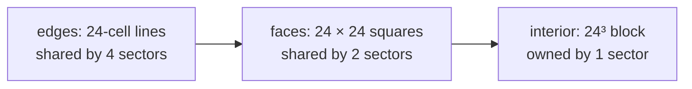

---
tags:
  - algorithm
  - wfc
  - streaming
  - milestone/0.2.0
  - planned
status: current
---

# Model Synthesis and Sectors

> [!summary]
> Plain Wave Function Collapse fails more and more often as the grid grows,
> and an endless world is the largest grid there is. Paul Merrell's model
> synthesis avoids this by never solving the whole thing: it starts from a
> trivially valid world and rewrites one small block at a time, with the
> block's border held fixed. We take that discipline and make each 48 m
> sector the block. To let sectors be generated in any order, and in
> parallel, the parts shared between sectors are solved first from their own
> hash keys: edges, then faces, then the interior. Two neighbouring sectors
> then compute the identical shared face without ever talking to each other,
> which is exactly what streaming needs. Nothing is implemented yet; the
> scheme comes from [[RESEARCH_WFC]].

## Why plain WFC does not scale

Every observation in [[wave-function-collapse]] carries a small risk of
dooming some cell later. The more cells, the more observations, and the
chance that a whole run succeeds shrinks towards zero: past a certain size
restarting no longer helps. Merrell's comparison attributes much of the
extra failure to the lowest-entropy ordering on large outputs; for small
outputs the order barely matters and failures are rare.

So the grid must stay small. The question is how to build an unbounded world
out of small solves whose seams still match.

## Merrell's block scheme

Model synthesis (Merrell 2007, 2009) uses the same kind of constraint solver
as WFC, with a different outer loop:

1. **Start from a valid model.** The whole output is filled with a tile that
   satisfies every rule on its own, such as "ground" or, for us, solid rock.
2. **Pick a block**, a small region of the output.
3. **Reset the block** to "anything possible", but keep the cells around it
   fixed at their current tiles. Those fixed cells constrain the block's
   border.
4. **Solve the block.** If it succeeds, keep it. If it fails, retry or simply
   leave the old contents, which were valid.
5. Move to the next block, usually overlapping the previous one.

The output is valid after every step, and a failed block never damages
anything else. That makes the approach robust at any size. The price, as
Boris the Brave found when porting it, is that the result depends on the
order blocks are visited, and the overlaps repeat work. Punch Out Model
Synthesis refines the failure case by eroding the already-solved region
around a failed block, and introduces a "tile correlation length" that says
how small a block a tileset tolerates.

## The sector as the block

A sector is 24 × 24 × 24 cells of 2 m. If every sector's border were fixed
and the interior solved inside it, a sector would be exactly one
modify-in-blocks step over an implicit all-solid world. The open problem is
the border: where do the fixed boundary tiles come from?

**Order-dependent (rejected).** A sector copies the boundary tiles of
whichever neighbours already exist. Simple, but the sector's contents then
depend on which neighbour was loaded first. That breaks the rule that every
decision is a pure function of seed and coordinates, and unloading a sector
is no longer free, because regenerating it might produce something else.

**Order-independent, face-first (recommended).** Shared boundaries are
solved on their own, before either sector, from keys that belong to the
boundary itself rather than to either sector:



- An **edge** is solved as a one-dimensional line from its own hash key.
- A **face** is solved as a two-dimensional grid whose four edges are
  already fixed, pre-collapsed at the walkable-graph portals on it
  ([[sector-skeleton-and-walkable-graph]]).
- The **interior** is solved with all six faces fixed.

Each piece is keyed by its world position: a face between sectors `s` and
`s + x` is identified by `s` and the axis, whichever of the two sectors asks.
Both sectors therefore compute the same face, bit for bit, independently.

### Worked example in 2D

Four sectors seen from above. Letters mark who owns what:

```
 +----e1----+----e2----+
 |          |          |
 e3   A     f1    B    e4
 |          |          |
 +----f2----+----f3----+
 |          |          |
 e5   C     f4    D    e6
 |          |          |
 +----e7----+----e8----+
```

In 2D the shared pieces are points (the `+` corners) and lines. Sector A
needs lines `e1`, `e3`, `f1` and `f2`. Line `f1` is shared with B; its key is
"the vertical line east of A". When B is generated first, it solves `f1` from
that key and uses it. When A is generated later, maybe on another thread or
after B was unloaded, it solves `f1` from the same key and gets the same
tiles. Neither sector ever reads the other's result. In 3D the same idea
has one more level: corners feed edges, edges feed faces, faces feed the
interior.

## Why it suits streaming

- **Any order, any thread.** A sector depends only on the seed and keys of
  its own boundary, so loading order does not matter and sectors can be
  solved in parallel on the worker pool.
- **Unloading is free.** A sector regenerated later is identical, so it can
  be thrown away as soon as the player walks off; a small cache only avoids
  repeating the work.
- **Fixed work per sector.** Boris the Brave's infinite modifying in blocks
  gets constant, deterministic work per block from a fixed dependency tree.
  Ours has depth three: edges, faces, interior.
- **Failures stay local.** A contradiction restarts or degrades one sector
  interior (see [[wave-function-collapse#Contradictions and restarts]]); a
  face that fails is recomputed identically from both sides, degraded the
  same way.

The risk is that six fixed faces over-constrain the interior. The universal
solid tile guarantees an interior solution always exists; the remaining risk
is aesthetic. The mitigation is to weight face solves towards solid and air,
so interesting geometry lives inside sectors rather than on their seams.

## Open questions

- **What a face is.** Either the sectors share a layer of cells (each
  sector's outermost layer is the face and both keep it), or the face is a
  plane of socket values between two cell layers. The first is simplest for
  the solver; the second avoids duplicated cells. Decide before the
  face-first solve is built.
- **Corners.** A corner cell belongs to three edges and eight sectors, so
  corners need their own level below edges, or a rule that fixes them to
  solid.
- **Seams that look like seams.** Face solves see only the 2D face, not the
  rooms on either side. If sector borders become visible as walls of solid,
  faces may need hints from the skeleton (for example "both sides are
  stratum, keep the floor open").
- **Block size.** 24³ is a guess. The tile correlation length from Punch Out
  Model Synthesis could tell whether the tileset needs larger or smaller
  blocks.
- **Boundary scheme** is decision 1 in [[RESEARCH_WFC#Decisions to make]]
  and still open.

## References

Sources:

- Merrell 2007, Example-Based Model Synthesis
- Merrell 2009, Model Synthesis (PhD thesis)
- Merrell 2021, Comparing Model Synthesis and Wave Function Collapse
- Boris the Brave, Model Synthesis and Modifying in Blocks
- Boris the Brave, Infinite Modifying in Blocks
- Punch Out Model Synthesis (arXiv 2501.14786)

Related notes: [[wave-function-collapse]], [[socket-adjacency]],
[[sector-skeleton-and-walkable-graph]], [[integer-hash]], [[RESEARCH_WFC]],
[[MEGASTRUCTURE_CONCEPT]].

Code: none yet.
