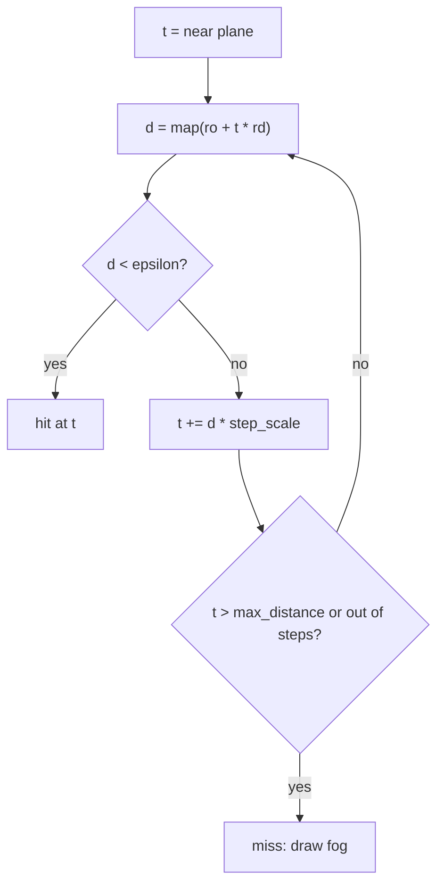

---
tags:
  - algorithm
  - rendering
  - sdf
status: current
---

# SDF Ray Marching

> [!summary]
> The milestone 0.0.1 renderer draws the chasm without any meshes. The scene
> is a single function that, for any point in space, answers "how far is the
> nearest surface?". A ray from the camera repeatedly asks that question and
> jumps forward by the answer, which can never carry it through a wall, until
> the answer is almost zero: that is the hit. This only works if the function
> never claims more free space than there really is, and most of the work in
> porting the prototype went into making our hashed, repeated geometry keep
> that promise. The same function also gives normals, ambient occlusion and
> soft shadows for free. The renderer is a throwaway reference for the look;
> later milestones build meshes.

## What a distance field is

A **signed distance field** (SDF) is a function `d(p)` that returns the
distance from point `p` to the nearest surface: positive in empty space,
negative inside solid, zero on the surface. Simple shapes have short exact
formulas: a sphere is `length(p) - r`, a box is a few `abs` and `max` calls
(see [sdf.gdshaderinc](../../shaders/include/sdf.gdshaderinc)). Scenes are
built by combining shapes:

| Operation | Formula | Result |
| --- | --- | --- |
| union | `min(a, b)` | exact outside both shapes, a lower bound inside |
| subtraction | `max(a, -b)` | a lower bound on the distance |
| intersection | `max(a, b)` | a lower bound on the distance |
| repetition | evaluate in `mod(p, cell)` | exact only if nothing crosses the cell |

Most of the chasm is not an exact distance field but a **distance bound**:
a function that may report less than the true distance, but never more.

## Sphere tracing

Sphere tracing (Hart 1996) marches a ray `p = ro + t * rd`:



The value `d` is the radius of a sphere around the current point that
contains no surface, so stepping `d` along any direction is safe. Far from
geometry the steps are huge; near a surface they shrink geometrically.

**Worked example.** A camera at `z = 0` looks straight at a wall at `z = 10`,
so `d = 10 - t`. With the project's `step_scale = 0.8` and
`hit_epsilon = 0.002`:

| step | t | d | epsilon | action |
| ---: | ---: | ---: | ---: | --- |
| 1 | 0.000 | 10.000 | 0.0020 | t += 8.000 |
| 2 | 8.000 | 2.000 | 0.0160 | t += 1.600 |
| 3 | 9.600 | 0.400 | 0.0192 | t += 0.320 |
| 4 | 9.920 | 0.080 | 0.0198 | t += 0.064 |
| 5 | 9.984 | 0.016 | 0.0200 | hit |

With `step_scale = 1` this exact plane would be hit in two steps; the 0.8
factor trades a few steps for a margin against bounds that are slightly too
optimistic. The hit threshold grows with distance (`hit_epsilon * max(t, 1)`)
because a far pixel covers more world space. Surfaces seen at a grazing angle
still need many steps; the "Steps" debug view shows where the budget goes.

## Why every term must be a lower bound

If `map` ever reports more than the true distance, the ray can jump past a
surface and come out on the other side. On screen this shows as holes,
missing thin features, fins and moiré along cell borders, all flickering as
the camera moves. Reporting less is always safe; it only costs steps.

`min` of lower bounds is a lower bound of the union, and `max(a, -b)` is a
lower bound of the subtraction, so plain combinations are fine. The danger is
**hashed repetition**. The world is chopped into cells, and each cell decides
by hash whether it contains a pillar, a bridge, a removed buttress. A point
evaluated in one cell sees only that cell's decision, but the nearest surface
may belong to the neighbour:

```
   cell 4 (no pillar)            cell 5 (pillar near its left border)
 +-----------------------------+-----------------------------+
 |                             |  ___                        |
 |                  p ---------|-(   )                       |
 |                             |  ---                        |
 +-----------------------------+-----------------------------+
   own cell says: nothing here      true distance from p: 2 m
```

If `p` only asks its own cell, the answer is "nothing" (the prototype added
no pillar term at all for an empty cell), the reported distance is whatever
the facades are, possibly a hundred metres, and the ray steps straight
through the pillar next door. The fix is always the same pattern:

1. evaluate the point's own cell;
2. evaluate the neighbours that could hold something closer, usually the one
   to three cells towards the nearest border or corner;
3. bound everything further away by the distance to the far border, since
   anything there is at least that far off;
4. guarantee, by clamping hashed offsets, that each object stays inside its
   own cell, so step 3 is true.

## The bounds we tightened

The prototype [megastructure-chasm.html](../megastructure-chasm.html) got away
with rough bounds at its fixed parameters. The port in
[chasm.gdshaderinc](../../shaders/include/chasm.gdshaderinc) exposes every
constant as a tweakable uniform, so the bounds had to hold for any setting:

- **Terrace borders** (`chasm_terrace_border`). A recessed terrace cell sits
  next to cells that may be less recessed, whose wall and protrusions reach
  right up to the border. The prototype assumed a flat 10 m of protrusion.
  The port evaluates the three neighbours towards the nearest corner with
  their actual recess and features, and bounds all other cells by half a
  cell.
- **Openings next to terrace borders.** Inside an opening the point is behind
  the wall plane, so a *more* recessed neighbour can also be close. The
  neighbour is bounded with the same opening punched at its own depth:
  bounding it as a solid wall was also a lower bound, but one that reached
  zero on the border plane right through the hole, and rays stopped on it
  (visible as fins and moiré).
- **The opening box** (`chasm_wall`). The subtracted box extends as far in
  front of the wall plane as behind it. With a box that ended exactly at the
  wall face, rays aimed into the mouth converged on a zero distance at the
  coplanar front face instead of entering the hole.
- **Removed buttresses** (`chasm_buttress_neighbours`). Removal is decided per
  40 × 120 m cell, and with the defaults the cell borders run along buttress
  centrelines, so a neighbour may keep half a buttress right at the border.
  The prototype only looked at the vertical neighbour; the port checks three.
- **Pillars, bridges and cables** (`chasm_pillars`, `chasm_bridges`,
  `chasm_cables`). The prototype looked only at the point's own cell. The
  port also checks the neighbours towards the nearer borders, bounds the rest
  by the far border, and clamps hashed offsets so objects stay inside their
  cells (cable radii above 1.5 m would break this, as the uniform's comment
  says).

One deliberate exception: near terrace borders the bound is floored at 3 cm
(`max(..., 0.03)`) so rays grazing a border keep moving instead of stalling at
a near-zero distance. That is a tiny, local overestimate traded for stability.

## Normals, AO and soft shadows from the field

The distance field answers more than "where is the hit":

- **Normals** (`calc_normal` in
  [raymarch_world.gdshader](../../shaders/raymarch_world.gdshader)): the
  gradient of `d` points away from the surface. It is estimated with four
  samples at the corners of a small tetrahedron. The offset is an absolute
  `normal_epsilon` of 4 mm; scaling it with distance smeared normals across
  ledges and terrace borders.
- **Ambient occlusion** (`surface_ao` in
  [surface.gdshaderinc](../../shaders/include/surface.gdshaderinc)): step a
  few taps out along the normal and compare the tap height `h` with `d`. In
  the open `d ≈ h`; in a corner `d < h`, and the sum of the differences,
  weighted down with each tap, darkens the point.
- **Soft shadows** (`lighting_shadow` in
  [lighting.gdshaderinc](../../shaders/include/lighting.gdshaderinc)): march
  from the hit towards the light and keep the smallest `k * d / t`. A ray that
  passes close to an occluder without hitting it gets a partial value, which
  gives a penumbra that widens with distance (Quilez's technique).

These uses feed the field's values straight into shading, so loose bounds
show up there too: an underestimate darkens AO and shadows slightly, and a
bound that differs from the true distance can tilt normals near borders.

## Status: a throwaway renderer

The ray marcher exists to reproduce the prototypes' look inside Godot, with a
free-fly camera and a tweak panel, and to give later milestones a reference
to compare against. It is not the production path: milestone 0.0.2 and later
place hand-authored tile meshes chosen by
[[wave-function-collapse]], rendered by Godot's own pipeline (see
[[RESEARCH_WFC]] and [[PLAN_0.0.1]]). Nothing in the fill layer depends on
this renderer except the [[integer-hash]].

## Open questions

- **Distant impostors.** The concept asks whether an SDF version of each
  sector could render distant geometry cheaply instead of mesh LODs. The
  bounds work here is the prerequisite for that.
- **Step budget at grazing angles.** Long facades seen edge-on use most of
  the 180 steps; there is no relaxation or cone-based acceleration yet.
- **Checking bounds automatically.** Lower bounds are argued in comments, not
  tested. A headless check that samples points and compares `map` with a
  brute-force nearest-surface search would catch regressions.

## References

Sources:

- Hart 1996, Sphere Tracing: A Geometric Method for the Antialiased Ray
  Tracing of Implicit Surfaces
- Quilez, Distance Functions (article)
- Quilez, Soft Shadows in Raymarched SDFs (article)

Related notes: [[chasm-distance-field]], [[integer-hash]], [[PLAN_0.0.1]].

Code: [raymarch_world.gdshader](../../shaders/raymarch_world.gdshader),
[raymarch.gdshaderinc](../../shaders/include/raymarch.gdshaderinc),
[sdf.gdshaderinc](../../shaders/include/sdf.gdshaderinc),
[chasm.gdshaderinc](../../shaders/include/chasm.gdshaderinc),
[surface.gdshaderinc](../../shaders/include/surface.gdshaderinc),
[lighting.gdshaderinc](../../shaders/include/lighting.gdshaderinc), and the
prototype [megastructure-chasm.html](../megastructure-chasm.html).
