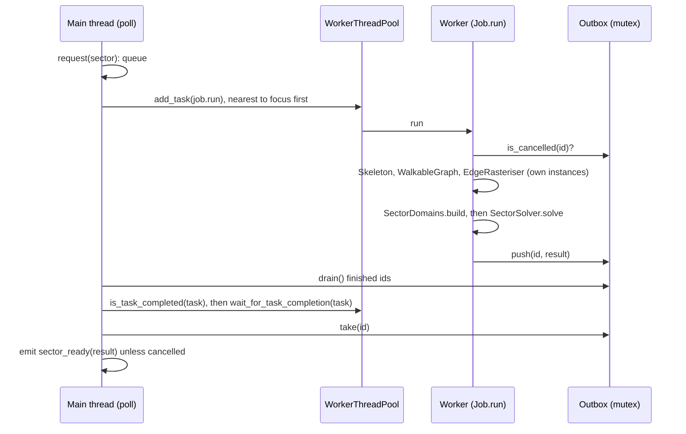

---
tags:
  - algorithm
  - streaming
  - threads
  - milestone/0.2.0
  - implemented
status: current
sources:
  - "[[godot-docs-workerthreadpool]]"
  - "[[godot-docs-thread-safe-apis]]"
---

# Sector Jobs

> [!summary]
> Solving a sector takes from a tenth of a second to several seconds in
> GDScript, far longer than one frame. `SectorJobs` moves that work off the
> [[GLOSSARY#Main thread|main thread]]. Each requested sector becomes one
> [[GLOSSARY#Sector job|sector job]]: a task on Godot's
> [[GLOSSARY#WorkerThreadPool|WorkerThreadPool]] that runs the whole fill
> pipeline (sector type, records, domains, solve) on objects of its own. It
> hands back a plain dictionary of tile indices. Once per frame the main
> thread collects the finished tasks and emits `sector_ready`. It never
> waits on a task that is still running, and every task id is waited on
> exactly once. Queued sectors start nearest to a focus sector first. A
> sector can be cancelled while queued or running; its result is then
> dropped. Solved on 8 threads, 27 sectors give byte for byte the same cells
> as on the main thread. The longest poll took 0.5 ms, well inside the
> 4 ms budget, at 4.7 sectors per second.

This is milestone 0.2.0 item E3 of [[RESEARCH_WFC]] section 7, following
its section 4 on threads. It runs [[sector-solver]], or optionally
[[face-first-boundaries]], per task. Code: [[solver]].

## Interface

```gdscript
var jobs := SectorJobs.new()
add_child(jobs)                                   # polls from _process
jobs.configure(TileLibrary.build(load("res://resources/tilesets/placeholder.tres")), seed, grammar)
jobs.sector_ready.connect(_on_sector_ready)       # result: Dictionary
jobs.focus = player_sector                        # nearest queued sector starts first
jobs.request(Vector3i(3, 0, 7))                   # false when already queued or running
jobs.cancel(Vector3i(3, 0, 7))                    # queued: dropped; running: result discarded
jobs.clear()                                      # cancel everything, e.g. after a seed change
```

- `use_boundaries` solves through a cold `SectorBoundaries` per task instead
  of `SectorDomains` and one `SectorSolver`.
- `max_in_flight` is the most tasks running at once, cancelled ones
  included. It defaults to half the logical CPUs (decision #168).
- `start_budget_usec` (1 ms) stops a poll from starting more tasks once it
  has run that long; it always starts one when a slot is free.
- `tasks_started`, `tasks_waited`, `last_poll_usec`, `max_poll_usec`,
  `pending_count()`, `in_flight_count()`, `running_sectors()` and
  `is_busy()` are there for tools and tests.
- `wait_all()` blocks until every started task is waited on. `_exit_tree`
  calls `clear()` and `wait_all()`, so freeing the node never leaves a task
  behind.
- `SectorJobs.solve_sector(library, grammar, seed, sector, boundaries)` is
  the pipeline itself, static and callable from any thread.

## The pipeline of one job



1. **Request.** `request(sector)` only appends a job to the queue. It never
   starts a task, so every request made in the same frame competes for the
   first free slot by distance.
2. **Start.** `poll` takes the queued job nearest to `focus` (squared
   distance in sector units, then request order) while fewer than
   `max_in_flight` tasks run. It copies the library, grammar, seed and
   boundary flag into the job and calls `WorkerThreadPool.add_task(job.run)`
   with high priority. Low-priority tasks share only a few pool threads
   (`threading/worker_pool/low_priority_thread_ratio`; 4 of 16 here).
   `max_in_flight` already leaves room for the engine's own tasks.
3. **Run** (worker). `SectorJobs.solve_sector` builds a `Skeleton` on the
   shared grammar, a `WalkableGraph`, an `EdgeRasteriser`, then the domains
   and a `SectorSolver` for the sector. With `use_boundaries` it builds a
   `SectorBoundaries` instead. Solve seed = world seed, as in
   `SolverSectorRun`. The result dictionary is pushed into the outbox; that
   is the last thing the task does.
4. **Collect** (main thread). `poll` drains the ids pushed since the last
   poll. For each, it asks `is_task_completed`. A task that pushed but has
   not returned yet is asked again next frame. It then calls
   `wait_for_task_completion`, which returns at once, and takes the result
   out of the outbox.
5. **Emit.** After the timing of the poll ends, `sector_ready(result)` is
   emitted for every job that was not cancelled. Turning the cells into
   nodes (#95, #96) happens in the handler, on the main thread.

## Handoff format

The result is a `Dictionary` built on the worker. No object in it is shared
with another thread:

| Key | Type | Meaning |
| --- | --- | --- |
| `sector` | `Vector3i` | The requested sector. |
| `outcome` | `int` (`SectorSolver.Outcome`) | Without boundaries: the solver's outcome, or `FAILED` when the records cannot become domains. With boundaries: `FAILED` when any piece failed, else `DEGRADED` when any piece degraded, else `SOLVED`. |
| `cells` | `PackedInt32Array` | Tile index per cell, `x + n * (y + n * z)`. Empty when the solve failed without boundaries. With boundaries failed pieces are solid, so the cells are always there. |
| `attempts` | `int` | Solver attempts, summed over the pieces with boundaries. |
| `time_usec` | `int` | Wall time of the whole pipeline on its worker. |
| `degraded` | `bool` | Some or all cells are the solid fallback, not a solve. |
| `error` | `String` | Why it failed, or `""`. |
| `cancelled` | `bool` | Always false in an emitted result. |

Packed arrays are copy-on-write with an atomic reference count, so handing
`cells` over costs nothing, and the main thread's copy never changes.

## Thread-safety rules

What a task may touch follows [[godot-docs-thread-safe-apis]]:

- **Nothing from the scene tree** and no `RenderingServer` or
  `PhysicsServer3D` call. A task produces data; the main thread builds nodes.
- **No shared mutable state.** Each task creates its own `Skeleton`,
  `WalkableGraph`, `EdgeRasteriser`, `SectorSolver` and `SectorBoundaries`.
  `WalkableGraph` writes its face cache, and `SectorSolver` and
  `SectorBoundaries` keep working arrays and piece caches between calls, so
  they must never be shared between threads.
- **Shared, read-only after `configure`:**
  - The `TileLibrary`. After `TileLibrary.build` nothing writes to it.
    `allowed` returns a slice, `is_allowed` and `tiles` only read. Socket
    parsing, the one use of static `RegEx` state (in `TilePrototype`), happens
    during `build` on the main thread.
  - The `SectorGrammar`. `configure` duplicates the caller's resource, so
    editing a grammar in the tweak panel never reaches a running task.
    Call `configure` again after a change.
- **The plain `Skeleton` is read-only after construction.** `sector_type`
  only reads `grammar` and calls the static `Hash` functions, so it could be
  shared. Each task still builds its own, which costs nothing. The caching
  `GraphLines.CachedSkeleton` writes a `Dictionary` on every lookup. It
  belongs to the viewer and must never be handed to a job.
- **Static functions** (`Hash`, `SectorDomains`, the `STEPS` and name
  constants) hold no state and are safe from any thread.
- **Between the threads** there is one `Outbox` behind one `Mutex`: result
  dictionaries by job id, the list of ids pushed since the last drain, and
  the cancelled ids. A `Job`'s fields are written on the main thread before
  its task starts and only read afterwards. Its main-thread `cancelled` flag
  is never read by the task.
- **Tasks never wait on other tasks**, and the main thread waits only on
  tasks that pushed a result. The `Job` is held in the in-flight table until
  it is waited on, so the object behind the task's callable outlives the
  task.

## Cancellation

- **Queued:** `cancel` removes the job; no task ever exists.
- **Running:** `cancel` marks the job cancelled and adds its id to the
  outbox. The task checks before building the domains and again before the
  solve. If it sees the mark, it skips the rest and pushes a result with
  `cancelled` true. A solve already under way is not interrupted. The task
  still counts towards `max_in_flight` and is waited on like any other; its
  result is dropped instead of emitted.
- **Again:** a cancelled sector can be requested at once. The new job is
  separate, and the old one's result never reaches it.
- **`clear()`** cancels everything, **`wait_all()`** blocks until nothing is
  in flight, and **freeing the node** does both.

## Measurements

`mise run jobs-check` (27 sectors of the 3³ block around the origin, seed 0,
i9-9880H with 8 cores and 16 threads, another worker's checks running,
load average about 7):

| Tasks in flight | Longest poll | Mean poll | Throughput | Speed-up over the main thread |
| --- | --- | --- | --- | --- |
| 3 | 0.33 ms | 0.035 ms | 2.95 sectors/s | 1.8× |
| 8 (default) | 0.43 to 0.74 ms | 0.05 ms | 4.0 to 4.7 sectors/s | 2.5 to 2.8× |
| 15 (CPUs − 1) | 5.6 to 11 ms | 0.1 to 0.3 ms | 3.8 to 4.1 sectors/s | 2.2× |

- **All 27 results were byte for byte identical** to the main-thread solve
  (11 solved, 16 failed before an attempt, because many real sectors still
  fail on their records: #159, #161).
- **A task runs slower than the same sector alone.** With 1 task in flight,
  a solid sector took 131 ms against 98 ms on the main thread. The extra
  time is the cold graph each task builds. With 8 tasks the same sector took
  about 470 ms, and a stratum sector 5.1 s against 3.5 s. Graph and
  rasteriser stages create many small objects and slow down most. Packed
  array solving slows down least. Throughput stops growing near the physical
  core count, and more tasks only take CPU time from the main thread
  (decision #168).
- **The main-thread speed-up is limited by the slowest sector.** The three
  stratum sectors that solve take 3 to 3.6 s each, so the 27 sectors cannot
  finish sooner. The synchronous comparison also reuses one warm graph.
- **Boundaries, cold per task:** with `--boundaries` on 8 sectors, each task
  took 3.6 to 4.5 s. The same sectors took 0.3 to 0.8 s one after another
  through one warm `SectorBoundaries` on the main thread. That is a speed-up
  of 1.0× (decision #169).
- **An unwaited task prints nothing** in Godot 4.7.2 headless, even with
  `--verbose`. A test script that never waited produced no message. So
  `jobs-check` compares `tasks_started` with `tasks_waited` itself and still
  fails on any `WorkerThreadPool`, `WARNING:` or `ERROR:` line in the log.

Two design choices keep the poll short:

- **Collect only what finished.** The first version called
  `is_task_completed` on every running id each frame and hit 3 ms polls in
  which nothing had finished. Workers now announce their push through the
  outbox, so a quiet frame costs one mutex lock.
- **Budget starts.** Starting 15 tasks in one poll took 2 to 11 ms: each
  start wakes a pool thread that preempts the main thread.
  `start_budget_usec` spreads the starts over several frames.

## Open questions

- **Default tasks in flight** (#168): half the logical CPUs, CPUs − 1 or a
  setting.
- **Sharing boundary pieces between tasks** (#169): cold per task, a locked
  piece cache, boundary pieces as jobs of their own, or pieces from the
  streaming LRU (#98).
- **Interrupting a solve.** A cancelled task finishes the solve it is in.
  A cancel check between solver attempts would free the slot sooner, but it
  would put a callable into `SectorSolver`.
- **Worker-side placement data.** E2 (#96) moves the MultiMesh buffers and
  collision faces into the task, and they join the result dictionary.
- **Solver cost** dominates: see the native threshold #138.

## References

- [[godot-docs-workerthreadpool]]: tasks, polling and the rule that every task
  is waited on.
- [[godot-docs-thread-safe-apis]]: what a thread may touch.
- [[RESEARCH_WFC]], sections 4 (threads) and 5 (streaming), and 7 (E3).
- [[sector-solver]], [[face-first-boundaries]], [[edge-rasteriser]]: what a
  task runs.
- Code: [[solver]], [[tools-and-tasks]].
