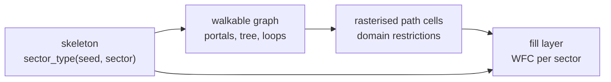
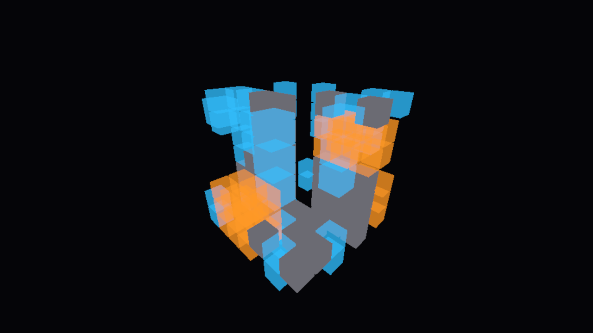
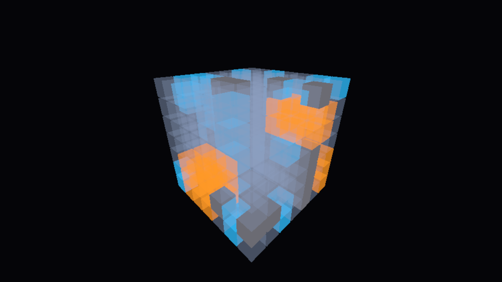
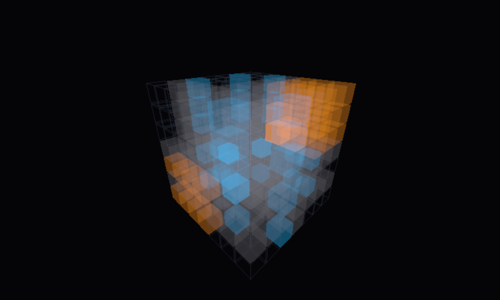
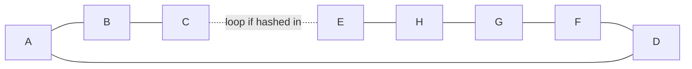

---
tags:
  - algorithm
  - skeleton
  - graph
  - milestone/0.2.0
  - implemented
  - planned
status: draft
---

# Sector Skeleton and Walkable Graph

> [!summary]
> Before any tile is placed, the world is laid out at two coarse levels. The
> **skeleton** divides space into 48 m sectors and gives each a type (stratum,
> shaft, cavity, solid or chasm) from a hash of its coordinates, with rules
> that make solid walls and floors split space into separate blocks, shafts
> run from floor to floor and voids cluster. The **walkable graph**
> then connects the open sectors: a portal on each shared face, a spanning
> tree so everything is reachable, and a few extra edges so there are loops.
> The graph is the only thing the tile solver must obey; it guarantees the
> world can be walked by construction instead of by luck.

> [!warning] Partly planned
> The hashed sector grammar is implemented (issue #76,
> [[0015-hashed-multi-scale-sector-grammar]]), drawn by the skeleton viewer
> (#77, `mise run run-skeleton`, see [[skeleton]]) and tuned against measured
> structure (#78, [[0016-tuned-sector-grammar-solid-before-voids]]). The
> walkable graph is
> not implemented or decided yet. It collects the design from
> [[MEGASTRUCTURE_CONCEPT]] and [[RESEARCH_WFC]] into one place, with a
> sketch of how it could work, so the graph issues start from a shared
> picture. Expect it to change.

## Where it sits



Each layer reads only the layers before it, and every step is a pure function
of the seed and coordinates, drawn from the [[integer-hash]].

## The hashed sector grammar

Sectors are 48 m cubes, 24 fill cells of 2 m on a side. The concept defines
five types:

| Type | Rule of thumb | Prototype analogue |
| --- | --- | --- |
| stratum | the default; horizontal floors every 6 m | slabs and column grid |
| shaft | vertical void 4 to 16 m wide, prefers to continue up and down | shaft cells, hash < 0.42 |
| cavity | rare, enormous, spans several sectors | cavity cells, hash < 0.14 |
| solid | impassable mass that hides one region from the next | implicit |
| chasm | very rare long vertical canyon between facades | the exterior prototype |

`Skeleton.sector_type(seed, cell)` takes the seed and the sector index
`Vector3i(ix, iy, iz)` (sector `i` covers `48 i` to `48 (i + 1)` metres on
each axis) and returns one of `STRATUM`, `SHAFT`, `CAVITY`, `SOLID` or
`CHASM`. It never looks at neighbouring sectors, so any sector can be asked
in any order. Structure comes from hashing at several scales, the same way
the interior prototype [megastructure.html](../megastructure.html) does: its
shafts are decided per 48 m column in `x, z` (salt 10, size 11, offset 12 and
13), so a shaft runs the full height; its cavities per 112 m cube (salt 20,
sizes 21 to 23, offsets 24 to 26), so one void covers parts of several
sectors. In the skeleton every rule is decided on a cell **coarser than one
sector**, and the hash of that coarse cell places a run, box or plane of
sectors inside it.

### Rules

Rules are tested in order of precedence; the first rule that claims the
sector decides its type:

**chasm > solid > cavity > shaft > stratum**

1. **Chasm.** The world is cut into bands `chasm_band` = 32 sectors wide in
   `x` and `chasm_band_height` = 96 sectors tall in `y`. With probability
   `chasm_probability` = 0.02 a band holds one canyon `chasm_width` = 6
   sectors (288 m) wide, at a hashed `x` offset, with a hashed height of 32
   to 96 sectors at a hashed `y` offset. It runs without end along `z`.
   Chasms override everything because they are the rarest and largest
   feature and must cut cleanly through the rest.
2. **Solid.** Two kinds of plane, both split into square panels that close
   as a whole:
   - *Walls.* Space is cut into `x` bands of `solid_wall_grid` = 6 sectors.
     Each band has one wall plane at a hashed `x` offset, shared by every
     `y` and `z`, so walls line up into long vertical partitions; likewise
     along `z`. A wall plane is split into panels of `solid_wall_panel` = 12
     sectors (in `y` and the other horizontal axis), and each panel is closed
     with `solid_wall_probability` = 0.6.
   - *Floors.* Space is cut into `y` bands of `solid_floor_grid` = 4 sectors,
     each with one floor plane at a hashed height shared by every `x` and
     `z`. A floor plane is split into panels of `solid_floor_panel` = 24
     sectors, each closed with `solid_floor_probability` = 0.85.
   Solid ranks above cavities and shafts, so a closed panel is never pierced
   and really separates the space on its two sides.
3. **Cavity.** Space is cut into cubes of `cavity_cell` = 4 sectors (192 m).
   With probability `cavity_probability` = 0.15 a cube holds one box, 3 to 4
   sectors along each axis at a hashed offset. Voids cluster because one hash
   opens up to 64 sectors at once; solid planes crossing the box cut it into
   halls on either side.
4. **Shaft.** The floor planes cut every column into **floor layers**: a
   layer starts at one floor plane and ends just below the next, so it is 1
   to 7 sectors tall, 4 on average. A column `(ix, iz)` holds a shaft with
   probability `shaft_probability` = 0.12 through `shaft_layers` = 3
   consecutive layers at once (the decision is keyed on the layer index
   divided by 3). Where the floor panel is closed, solid wins on the plane
   and the shaft stops under it; where it is open, the shaft continues into
   the next layer. Shafts therefore run floor to floor and often through
   several storeys.
5. **Stratum** otherwise: the default, horizontal habitable layers.

Integer choices (sizes, offsets) take the 32-bit `hash3_u` modulo the range;
chances compare `hash3` with the probability. Coarse cells use floor
division, so negative sectors fall into the cell below zero instead of
sharing cell 0. Parameters out of range (a minimum above its maximum, a box
larger than its cell, a zero cell size) are clamped when read, so the
function is total for every parameter set.

### Salts

Salts 100 to 139 belong to the skeleton; they do not overlap the prototype
and shader salts (below 100).

| Salt | Key | Decides |
| ---: | --- | --- |
| 100 | `(ix, floor(layer / shaft_layers), iz)` | column holds a shaft through those layers |
| 101, 102 | | retired (shaft run length and start before #78); never reuse |
| 110 | `floor(cell / cavity_cell)` | cube holds a cavity |
| 111, 112, 113 | same | cavity size in x, y, z |
| 114, 115, 116 | same | cavity offset in x, y, z |
| 120 | `(floor(ix / solid_wall_grid), 0, 0)` | x wall plane offset of the band |
| 121 | `(floor(iz / solid_wall_grid), 0, 0)` | z wall plane offset of the band |
| 122 | `(floor(iy / solid_floor_grid), 0, 0)` | floor plane offset of the band (also bounds the floor layers) |
| 123 | `(floor(ix / solid_wall_grid), floor(iy / solid_wall_panel), floor(iz / solid_wall_panel))` | x wall panel is closed |
| 124 | `(floor(ix / solid_wall_panel), floor(iy / solid_wall_panel), floor(iz / solid_wall_grid))` | z wall panel is closed |
| 125 | `(floor(ix / solid_floor_panel), floor(iy / solid_floor_grid), floor(iz / solid_floor_panel))` | floor panel is closed |
| 130 | `(floor(ix / chasm_band), floor(iy / chasm_band_height), 0)` | band holds a chasm |
| 131 | same | chasm x offset |
| 132 | same | chasm height |
| 133 | same | chasm y offset |

Salt 900 is used only by the histogram test to pick random cells, salt 901
only by the statistics task to pick random regions.

### Parameters

The parameters live in a `SectorGrammar` resource with `@export` fields, so
they can be edited in the inspector, saved as `.tres` and changed live in the
skeleton viewer's tweak panel, which generates its sliders from those
exports. `Skeleton.new()` uses the defaults above; `Skeleton.new(grammar)`
takes a tuned one.

### Tuning

The first defaults (#76) looked like noise from outside: shafts, cavities
and solid slabs scattered through the region with nothing separating one part
from the next. Issue #78 made "structured" measurable with
`mise run skeleton-stats`, which samples 20 random 5³ regions for each seed
0 to 4 and fails unless

- a vertical shaft run is at least **3 sectors** long on average (each run is
  followed past the region to its full length), and
- solid splits a region into at least **2 connected non-solid components** on
  average (6-connected union-find over the 125 sectors).

It also reports the type fractions, cavity clusters per region and the mean
stratum run along `x`, `z` and `y` inside the region, to check that strata
spread horizontally and voids cluster.

| Measure (100 regions) | Before (#76) | After (#78) |
| --- | ---: | ---: |
| stratum / shaft / cavity / solid / chasm | 58 / 20 / 10 / 12 / 0 % | 49 / 7 / 5 / 38 / 0.8 % |
| mean vertical shaft run | 5.78 sectors | 3.93 sectors |
| non-solid components per region | **1.05** (96 regions with one) | **2.43** (34 regions with one) |
| cavity clusters per region, size | 1.38, 8.8 sectors | 0.87, 7.0 sectors |
| stratum run x, z / y | 2.14, 2.27 / 3.27 | 2.56, 2.42 / 2.36 |

What the numbers showed along the way:

- **Precedence was the blocker.** With cavities and shafts above solid, every
  wall had holes; even walls closed in every block only reached 1.4
  components. Putting solid above the voids is what makes separation
  possible at all.
- **Per-block closure cannot close a plane.** A 5³ region crosses up to four
  blocks of a wall plane, all of which had to close (0.35⁴ ≈ 1.5 %). Panels
  much larger than the grid (12 for walls, 24 for floors) close a plane
  across the whole region with a single hash.
- **Floors cut shafts at random heights**, which dropped the mean run to
  about 3.2. Tying shafts to floor layers makes them end exactly at the
  slabs, and `shaft_layers` = 3 lets them continue through open floor
  panels, so the run stays near 4.
- **Strata ran taller than wide** as long as walls and shafts were denser
  than floors. Floors every 4 sectors with walls every 6 and sparse shafts
  (0.12) make the stratum runs wider than tall.
- **Cavities** got fewer and bigger (cell 4, boxes 3 to 4) so they read as
  halls rather than speckle; **chasms** got taller (32 to 96 sectors in a
  96-sector band) and stay rare.
- The price is **more solid** (38 %). Walls grid 7 or 8 with fewer shafts
  also passed but left strata taller than wide or needed walls closed
  everywhere, which reads as a regular lattice.

Before and after, seed 0, the 7³ sectors around the origin (`radius` 3)
from the outside view preset in [[skeleton]] (position `(-300, 260, -300)`,
yaw 0.79, pitch -0.48); first with stratum hidden, then shown. The before
images use the old fill mode (opaque solid, stratum as faint boxes); the
after images use the viewer's default style (translucent boxes for solid and
voids, stratum as faint wireframe cubes):






Before, shafts and cavities float in space with scattered grey blocks. After,
grey floors and walls frame the region into boxes, blue shafts run from slab
to slab inside them and orange halls sit between the planes.

### Worked example

Seed 0, the 9 × 9 × 9 sectors centred on the origin: 258 stratum, 54 shaft,
69 cavity, 348 solid and no chasm (chasms are too rare to appear in so small
a window). The full table, per layer, is [[skeleton_histogram_seed0]].

## The walkable graph

### Nodes and portals

- One **portal** on each face shared by two adjacent non-solid sectors. Its
  position on the face is hashed, snapped to the 2 m cell grid and, on
  vertical faces, to a floor height so corridors meet floors.
- One **interior node** per stratum sector.
- The portal between sector `s` and `s + axis` is keyed by `s` and the axis,
  so both sectors compute the same point without talking to each other, as
  the faces in [[model-synthesis-and-sectors]] do.

### Spanning tree plus loops

Every pair of adjacent open sectors is a candidate edge with a hashed weight.
Kruskal's algorithm takes the edges from lightest to heaviest and keeps an
edge only if it joins two groups that are not yet connected (tracked with
union-find). The result is a **spanning tree**: every open sector reachable from
every other one it touches through open sectors, and no cycles. A second hash then adds a few of the rejected edges back, which
gives **loops**, so the player is not always walking a dead-end tree.

**Worked example.** A 3 × 3 slice of sectors with a solid one in the middle:

```
 A  B  C
 D  #  E
 F  G  H
```

The candidate edges form a ring: A–B, B–C, C–E, E–H, H–G, G–F, F–D, D–A.
Say the hashed weights put C–E last. Kruskal accepts the first seven edges,
each joining new sectors, and rejects C–E because C and E are already
connected the long way round. The loop hash then decides whether C–E comes
back as an extra edge.



Vertical edges (stairs, ladders) should be rare and long: give them heavier
weights so the tree prefers horizontal edges, and a low loop probability. The
edge type (corridor, stair, ramp, ladder, bridge across a shaft or cavity,
catwalk along a shaft wall) follows from the two sector types and the axis.

### Output: the fill contract

Each sector gets a short list of edges with endpoints in local coordinates.
A rasteriser turns it into per-cell domain restrictions for the solver:
corridor cells may only be floor-like tiles, stair cells a specific oriented
stair. These restrictions are the only hard constraint the fill layer takes
from the graph ([[wave-function-collapse]]). Restricting a cell to a family
instead of a single tile leaves the solver room to place walls and columns
around the path.

## How it is checked

- `mise run skeleton-histogram` (part of `mise run check`) prints the seed 0
  histogram, checks that `sector_type` returns a type for 2 000 random cells
  and the int32 extremes, also under an out-of-range grammar, that two
  evaluations of 2 000 random cells agree, and that the histogram matches
  [[skeleton_histogram_seed0]].
- `mise run skeleton-stats` (part of `mise run check`) measures the structure
  of the default grammar and fails below the thresholds in
  [Tuning](#tuning).

Planned for the graph:

- A union-find pass over every 5³ window for seeds 0 to 9 reports the number
  of connected components of open sectors.
- Portal positions are compared from both sectors of a face over many random
  pairs.
- The rasterised records of one sector never conflict (the same cell with two
  disjoint restrictions).
- A debug view draws the graph as coloured lines around the free-fly camera.

## Open questions

- **Region boundaries.** The concept builds the tree per region of 3³
  sectors. Inside a region that guarantees connectivity; between regions,
  some edges across the region border must be kept too, and which ones must
  be decided from both sides identically. A single global minimum spanning
  tree is unique for distinct hashed weights but cannot be computed locally.
- **Solid that separates.** The grammar now splits every 5³ window into 2.4
  non-solid components on average, by design, while the connectivity check
  wants one component per window. Either corridors may tunnel through solid
  sectors, or the check counts components per window only where they touch
  the window's open boundary.
- **Per sector or per region.** The concept leaves open whether the graph is
  built per sector (fast, local) or per region (better long paths), and
  suggests starting with 3³ regions.
- **Vertical travel.** Stairs, ramps or ladders: what reads best and what the
  capsule controller handles.
- **Hashed or cellular grammar.** The tuning pass (#78) met its structure
  targets with the hashed grammar, so it stays hashed
  ([[0015-hashed-multi-scale-sector-grammar]],
  [[0016-tuned-sector-grammar-solid-before-voids]]); a cellular pass is not
  needed for now.

## References

Sources:

- Kruskal 1956, On the Shortest Spanning Subtree of a Graph and the
  Traveling Salesman Problem

Related notes: [[MEGASTRUCTURE_CONCEPT]] (skeleton and walkable graph),
[[RESEARCH_WFC]] (epics A and B), [[model-synthesis-and-sectors]],
[[wave-function-collapse]], [[integer-hash]].

Code: [[skeleton]] describes `SectorGrammar` and `Skeleton`; the graph has
no code yet. The interior prototype
[megastructure.html](../megastructure.html) shows the multi-scale hashed
shafts and cavities the grammar starts from.
