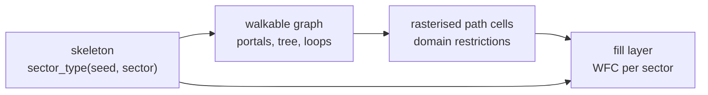
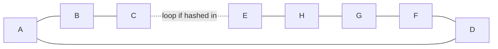

---
tags:
  - algorithm
  - skeleton
  - graph
  - milestone/0.2.0
  - planned
status: draft
---

# Sector Skeleton and Walkable Graph

> [!summary]
> Before any tile is placed, the world is laid out at two coarse levels. The
> **skeleton** divides space into 48 m sectors and gives each a type (stratum,
> shaft, cavity, solid or chasm) from a hash of its coordinates, with rules
> that make shafts run vertically and voids cluster. The **walkable graph**
> then connects the open sectors: a portal on each shared face, a spanning
> tree so everything is reachable, and a few extra edges so there are loops.
> The graph is the only thing the tile solver must obey; it guarantees the
> world can be walked by construction instead of by luck.

> [!warning] Planned
> Nothing in this note is implemented or decided. It collects the design from
> [[MEGASTRUCTURE_CONCEPT]] and [[RESEARCH_WFC]] into one place, with a
> sketch of how it could work, so the skeleton and graph issues start from a
> shared picture. Expect it to change.

## Where it sits



Each layer reads only the layers before it, and every step is a pure function
of the seed and coordinates, drawn from the [[integer-hash]].

## The hashed sector grammar

Sectors are 48 m cubes, 24 fill cells of 2 m on a side. The concept defines
five types:

| Type | Rule of thumb | Prototype analogue |
| --- | --- | --- |
| stratum | the default; horizontal floors every 6 m | slabs and column grid |
| shaft | vertical void 4 to 16 m wide, prefers to continue up and down | shaft cells, hash < 0.42 |
| cavity | rare, enormous, spans several sectors | cavity cells, hash < 0.14 |
| solid | impassable mass that hides one region from the next | implicit |
| chasm | very rare long vertical canyon between facades | the exterior prototype |

The first version is `sector_type(seed, ix, iy, iz)` with no neighbour
lookups at all. Structure comes from hashing at several scales, the same way
the interior prototype [megastructure.html](../megastructure.html) does: its
shafts are decided per 48 m column in `x, z` (salt 10, size 11, offset 12 and
13), so a shaft runs the full height; its cavities per 112 m cube (salt 20,
sizes 21 to 23, offsets 24 to 26), so one void covers parts of several
sectors.

One possible sketch, to be tuned in the skeleton viewer:

1. **Chasm** if a very coarse cell along one horizontal axis says so.
2. **Cavity** if the sector overlaps a cavity box hashed on a coarse 3D grid
   (voids cluster because the box is larger than a sector).
3. **Shaft** if the sector's column `(ix, iz)` is a shaft column and `iy`
   falls inside a hashed vertical run (shafts continue vertically).
4. **Solid** if a medium-sized 3D cell is marked solid (mass comes in lumps
   that separate regions).
5. **Stratum** otherwise.

The concept allows upgrading to an L-system or cellular pass only if the
hashed version looks random rather than structured.

## The walkable graph

### Nodes and portals

- One **portal** on each face shared by two adjacent non-solid sectors. Its
  position on the face is hashed, snapped to the 2 m cell grid and, on
  vertical faces, to a floor height so corridors meet floors.
- One **interior node** per stratum sector.
- The portal between sector `s` and `s + axis` is keyed by `s` and the axis,
  so both sectors compute the same point without talking to each other, as
  the faces in [[model-synthesis-and-sectors]] do.

### Spanning tree plus loops

Every pair of adjacent open sectors is a candidate edge with a hashed weight.
Kruskal's algorithm takes the edges from lightest to heaviest and keeps an
edge only if it joins two groups that are not yet connected (tracked with
union-find). The result is a **spanning tree**: every open sector reachable from
every other one it touches through open sectors, and no cycles. A second hash then adds a few of the rejected edges back, which
gives **loops**, so the player is not always walking a dead-end tree.

**Worked example.** A 3 × 3 slice of sectors with a solid one in the middle:

```
 A  B  C
 D  #  E
 F  G  H
```

The candidate edges form a ring: A–B, B–C, C–E, E–H, H–G, G–F, F–D, D–A.
Say the hashed weights put C–E last. Kruskal accepts the first seven edges,
each joining new sectors, and rejects C–E because C and E are already
connected the long way round. The loop hash then decides whether C–E comes
back as an extra edge.



Vertical edges (stairs, ladders) should be rare and long: give them heavier
weights so the tree prefers horizontal edges, and a low loop probability. The
edge type (corridor, stair, ramp, ladder, bridge across a shaft or cavity,
catwalk along a shaft wall) follows from the two sector types and the axis.

### Output: the fill contract

Each sector gets a short list of edges with endpoints in local coordinates.
A rasteriser turns it into per-cell domain restrictions for the solver:
corridor cells may only be floor-like tiles, stair cells a specific oriented
stair. These restrictions are the only hard constraint the fill layer takes
from the graph ([[wave-function-collapse]]). Restricting a cell to a family
instead of a single tile leaves the solver room to place walls and columns
around the path.

## How it will be checked

- A union-find pass over every 5³ window for seeds 0 to 9 reports the number
  of connected components of open sectors.
- Portal positions are compared from both sectors of a face over many random
  pairs.
- The rasterised records of one sector never conflict (the same cell with two
  disjoint restrictions).
- A debug view draws the graph as coloured lines around the free-fly camera.

## Open questions

- **Region boundaries.** The concept builds the tree per region of 3³
  sectors. Inside a region that guarantees connectivity; between regions,
  some edges across the region border must be kept too, and which ones must
  be decided from both sides identically. A single global minimum spanning
  tree is unique for distinct hashed weights but cannot be computed locally.
- **Solid that separates.** The grammar wants solid mass to split regions,
  while the connectivity check wants one component per window. Either
  corridors may tunnel through solid sectors, or the check counts components
  per window only where they touch the window's open boundary.
- **Per sector or per region.** The concept leaves open whether the graph is
  built per sector (fast, local) or per region (better long paths), and
  suggests starting with 3³ regions.
- **Vertical travel.** Stairs, ramps or ladders: what reads best and what the
  capsule controller handles.
- **Hashed or cellular grammar.** Whether the pure hash version looks
  structured enough, to be judged in the skeleton viewer.

## References

Sources:

- Kruskal 1956, On the Shortest Spanning Subtree of a Graph and the
  Traveling Salesman Problem

Related notes: [[MEGASTRUCTURE_CONCEPT]] (skeleton and walkable graph),
[[RESEARCH_WFC]] (epics A and B), [[model-synthesis-and-sectors]],
[[wave-function-collapse]], [[integer-hash]].

Code: none yet. The interior prototype
[megastructure.html](../megastructure.html) shows the multi-scale hashed
shafts and cavities the grammar starts from.
