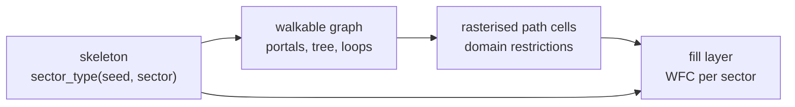

---
tags:
  - algorithm
  - skeleton
  - graph
  - milestone/0.2.0
  - implemented
  - planned
status: draft
---

# Sector Skeleton and Walkable Graph

> [!summary]
> Before any tile is placed, the world is laid out at two coarse levels. The
> **skeleton** divides space into 48 m sectors and gives each a type (stratum,
> shaft, cavity, solid or chasm) from a hash of its coordinates, with rules
> that make solid walls and floors split space into separate blocks, shafts
> run from floor to floor and voids cluster. The **walkable graph**
> then connects the open sectors: a portal on each shared face, a spanning
> tree per region so everything is reachable (tunnelling through solid where
> it must), and a few extra edges so there are loops.
> The graph is the only thing the tile solver must obey; it guarantees the
> world can be walked by construction instead of by luck.

> [!warning] Partly planned
> The hashed sector grammar is implemented (issue #76,
> [[0015-hashed-multi-scale-sector-grammar]]), drawn by the skeleton viewer
> (#77, `mise run run-skeleton`, see [[skeleton]]) and tuned against measured
> structure (#78, [[0016-tuned-sector-grammar-solid-before-voids]]). Of the
> walkable graph, the portals and interior nodes (#80) and the edges (#81,
> [[walkable-graph-connectivity]],
> [[0017-region-spanning-trees-with-tunnels]]) are implemented, see
> [[walkable-graph]], and so are the debug lines (#82) and the edge
> rasteriser (#83, [[edge-rasteriser]]). The note collects the design from
> [[MEGASTRUCTURE_CONCEPT]] and [[RESEARCH_WFC]] into one place, with a
> sketch of how it could work, so the graph issues start from a shared
> picture. Expect it to change.

## Where it sits

Each layer reads only the layers before it, and every step is a pure function
of the seed and coordinates, drawn from the [[integer-hash]].

## The hashed sector grammar

Sectors are 48 m cubes, 24 fill cells of 2 m on a side. The concept defines
five types:

| Type | Rule of thumb | Prototype analogue |
| --- | --- | --- |
| stratum | the default; horizontal floors every 6 m | slabs and column grid |
| shaft | vertical void 4 to 16 m wide, prefers to continue up and down | shaft cells, hash < 0.42 |
| cavity | rare, enormous, spans several sectors | cavity cells, hash < 0.14 |
| solid | impassable mass that hides one region from the next | implicit |
| chasm | very rare long vertical canyon between facades | the exterior prototype |

`Skeleton.sector_type(seed, cell)` takes the seed and the sector index
`Vector3i(ix, iy, iz)` (sector `i` covers `48 i` to `48 (i + 1)` metres on
each axis) and returns one of `STRATUM`, `SHAFT`, `CAVITY`, `SOLID` or
`CHASM`. It never looks at neighbouring sectors, so any sector can be asked
in any order. Structure comes from hashing at several scales, the same way
the interior prototype [megastructure.html](../megastructure.html) does: its
shafts are decided per 48 m column in `x, z` (salt 10, size 11, offset 12 and
13), so a shaft runs the full height; its cavities per 112 m cube (salt 20,
sizes 21 to 23, offsets 24 to 26), so one void covers parts of several
sectors. In the skeleton every rule is decided on a cell **coarser than one
sector**, and the hash of that coarse cell places a run, box or plane of
sectors inside it.

### Rules

Rules are tested in order of precedence; the first rule that claims the
sector decides its type:

**chasm > solid > cavity > shaft > stratum**

1. **Chasm.** The world is cut into bands `chasm_band` = 32 sectors wide in
   `x` and `chasm_band_height` = 96 sectors tall in `y`. With probability
   `chasm_probability` = 0.02 a band holds one canyon `chasm_width` = 6
   sectors (288 m) wide, at a hashed `x` offset, with a hashed height of 32
   to 96 sectors at a hashed `y` offset. It runs without end along `z`.
   Chasms override everything because they are the rarest and largest
   feature and must cut cleanly through the rest.
2. **Solid.** Two kinds of plane, both split into square panels that close
   as a whole:
   - *Walls.* Space is cut into `x` bands of `solid_wall_grid` = 6 sectors.
     Each band has one wall plane at a hashed `x` offset, shared by every
     `y` and `z`, so walls line up into long vertical partitions; likewise
     along `z`. A wall plane is split into panels of `solid_wall_panel` = 12
     sectors (in `y` and the other horizontal axis), and each panel is closed
     with `solid_wall_probability` = 0.6.
   - *Floors.* Space is cut into `y` bands of `solid_floor_grid` = 4 sectors,
     each with one floor plane at a hashed height shared by every `x` and
     `z`. A floor plane is split into panels of `solid_floor_panel` = 24
     sectors, each closed with `solid_floor_probability` = 0.85.
   Solid ranks above cavities and shafts, so a closed panel is never pierced
   and really separates the space on its two sides.
3. **Cavity.** Space is cut into cubes of `cavity_cell` = 4 sectors (192 m).
   With probability `cavity_probability` = 0.15 a cube holds one box, 3 to 4
   sectors along each axis at a hashed offset. Voids cluster because one hash
   opens up to 64 sectors at once; solid planes crossing the box cut it into
   halls on either side.
4. **Shaft.** The floor planes cut every column into **floor layers**: a
   layer starts at one floor plane and ends just below the next, so it is 1
   to 7 sectors tall, 4 on average. A column `(ix, iz)` holds a shaft with
   probability `shaft_probability` = 0.12 through `shaft_layers` = 3
   consecutive layers at once (the decision is keyed on the layer index
   divided by 3). Where the floor panel is closed, solid wins on the plane
   and the shaft stops under it; where it is open, the shaft continues into
   the next layer. Shafts therefore run floor to floor and often through
   several storeys.
5. **Stratum** otherwise: the default, horizontal habitable layers.

Integer choices (sizes, offsets) take the 32-bit `hash3_u` modulo the range;
chances compare `hash3` with the probability. Coarse cells use floor
division, so negative sectors fall into the cell below zero instead of
sharing cell 0. Parameters out of range (a minimum above its maximum, a box
larger than its cell, a zero cell size) are clamped when read, so the
function is total for every parameter set.

### Salts

Salts 100 to 139 belong to the skeleton; they do not overlap the prototype
and shader salts (below 100).

| Salt | Key | Decides |
| ---: | --- | --- |
| 100 | `(ix, floor(layer / shaft_layers), iz)` | column holds a shaft through those layers |
| 101, 102 | | retired (shaft run length and start before #78); never reuse |
| 110 | `floor(cell / cavity_cell)` | cube holds a cavity |
| 111, 112, 113 | same | cavity size in x, y, z |
| 114, 115, 116 | same | cavity offset in x, y, z |
| 120 | `(floor(ix / solid_wall_grid), 0, 0)` | x wall plane offset of the band |
| 121 | `(floor(iz / solid_wall_grid), 0, 0)` | z wall plane offset of the band |
| 122 | `(floor(iy / solid_floor_grid), 0, 0)` | floor plane offset of the band (also bounds the floor layers) |
| 123 | `(floor(ix / solid_wall_grid), floor(iy / solid_wall_panel), floor(iz / solid_wall_panel))` | x wall panel is closed |
| 124 | `(floor(ix / solid_wall_panel), floor(iy / solid_wall_panel), floor(iz / solid_wall_grid))` | z wall panel is closed |
| 125 | `(floor(ix / solid_floor_panel), floor(iy / solid_floor_grid), floor(iz / solid_floor_panel))` | floor panel is closed |
| 130 | `(floor(ix / chasm_band), floor(iy / chasm_band_height), 0)` | band holds a chasm |
| 131 | same | chasm x offset |
| 132 | same | chasm height |
| 133 | same | chasm y offset |

Salt 900 is used only by the histogram test to pick random cells, salt 901
only by the statistics task to pick random regions.

### Parameters

The parameters live in a `SectorGrammar` resource with `@export` fields, so
they can be edited in the inspector, saved as `.tres` and changed live in the
skeleton viewer's tweak panel, which generates its sliders from those
exports. `Skeleton.new()` uses the defaults above; `Skeleton.new(grammar)`
takes a tuned one.

### Tuning

The first defaults (#76) looked like noise from outside: shafts, cavities
and solid slabs scattered through the region with nothing separating one part
from the next. Issue #78 made "structured" measurable with
`mise run skeleton-stats`, which samples 20 random 5³ regions for each seed
0 to 4 and fails unless

- a vertical shaft run is at least **3 sectors** long on average (each run is
  followed past the region to its full length), and
- solid splits a region into at least **2 connected non-solid components** on
  average (6-connected union-find over the 125 sectors).

It also reports the type fractions, cavity clusters per region and the mean
stratum run along `x`, `z` and `y` inside the region, to check that strata
spread horizontally and voids cluster.

| Measure (100 regions) | Before (#76) | After (#78) |
| --- | ---: | ---: |
| stratum / shaft / cavity / solid / chasm | 58 / 20 / 10 / 12 / 0 % | 49 / 7 / 5 / 38 / 0.8 % |
| mean vertical shaft run | 5.78 sectors | 3.93 sectors |
| non-solid components per region | **1.05** (96 regions with one) | **2.43** (34 regions with one) |
| cavity clusters per region, size | 1.38, 8.8 sectors | 0.87, 7.0 sectors |
| stratum run x, z / y | 2.14, 2.27 / 3.27 | 2.56, 2.42 / 2.36 |

What the numbers showed along the way:

- **Precedence was the blocker.** With cavities and shafts above solid, every
  wall had holes; even walls closed in every block only reached 1.4
  components. Putting solid above the voids is what makes separation
  possible at all.
- **Per-block closure cannot close a plane.** A 5³ region crosses up to four
  blocks of a wall plane, all of which had to close (0.35⁴ ≈ 1.5 %). Panels
  much larger than the grid (12 for walls, 24 for floors) close a plane
  across the whole region with a single hash.
- **Floors cut shafts at random heights**, which dropped the mean run to
  about 3.2. Tying shafts to floor layers makes them end exactly at the
  slabs, and `shaft_layers` = 3 lets them continue through open floor
  panels, so the run stays near 4.
- **Strata ran taller than wide** as long as walls and shafts were denser
  than floors. Floors every 4 sectors with walls every 6 and sparse shafts
  (0.12) make the stratum runs wider than tall.
- **Cavities** got fewer and bigger (cell 4, boxes 3 to 4) so they read as
  halls rather than speckle; **chasms** got taller (32 to 96 sectors in a
  96-sector band) and stay rare.
- The price is **more solid** (38 %). Walls grid 7 or 8 with fewer shafts
  also passed but left strata taller than wide or needed walls closed
  everywhere, which reads as a regular lattice.

Before and after, seed 0, the 7³ sectors around the origin (`radius` 3)
from the outside view preset in [[skeleton]] (position `(-300, 260, -300)`,
yaw 0.79, pitch -0.48); first with stratum hidden, then shown. The before
images use the old fill mode (opaque solid, stratum as faint boxes); the
after images use the viewer's default style (translucent boxes for solid and
voids, stratum as faint wireframe cubes):

Before, shafts and cavities float in space with scattered grey blocks. After,
grey floors and walls frame the region into boxes, blue shafts run from slab
to slab inside them and orange halls sit between the planes.

### Worked example

Seed 0, the 9 × 9 × 9 sectors centred on the origin: 258 stratum, 54 shaft,
69 cavity, 348 solid and no chasm (chasms are too rare to appear in so small
a window). The full table, per layer, is [[skeleton_histogram_seed0]].

## The walkable graph

### Nodes and portals

`WalkableGraph` (#80) places the points the edges will join. All of them
live on the fill layer's grid: a sector of `n` = 24 cells of 2 m, sector `i`
covering cells `i n` to `(i + 1) n` on each axis.

- One **portal** on each face shared by two adjacent non-solid sectors
  (6-neighbours; diagonal, distant or solid pairs have none). The portal
  between sector `s` and `s + axis` is keyed by `s`, the **lower** sector of
  the pair, and gets its own salts per axis, so both sectors compute the same
  point without talking to each other, as the faces in
  [[model-synthesis-and-sectors]] do. `portal(a, b)` and `portal(b, a)` return
  identical values.
- The point is two coordinates on the face, in cells from the face's lower
  corner along the other two axes in xyz order. A horizontal coordinate is
  hashed into `1` to `n - 1`, so the point stays at least one 2 m cell from
  the face's edges. On vertical faces (x and z) the height is the **floor
  level of the lower sector's hub**: the level of its interior node, or for
  a solid lower sector (a tunnel edge) the centre level, 12 cells. So every
  horizontal edge is level on its lower side and changes height, if at all,
  only on its upper side, where the rasteriser puts an explicit stair run
  (#132). The portal is still keyed on the lower sector alone: its height
  reads that sector's type and node hash, never another portal or edge.
- One **interior node** per non-solid sector: hashed `x` and `z` inside the
  margin and a hashed **floor level**, a multiple of 3 cells (the 6 m
  stratum pitch) in the same margin, 6 to 42 m above the sector floor, so
  corridors meet floors. Stratum sectors are the
  walking nodes; shaft, cavity and chasm sectors get a node too, marked with
  their type, so the edge rules (#81) can route vertical travel and bridges
  differently.
- Every coordinate is a whole number of cells, so every point is on the 2 m
  grid and the path cells of the rasteriser (#83) line up with the tiles.

**Example.** Sectors `(0, 0, 0)` and `(1, 0, 0)`: the face is the plane
`x = 48 m`; the portal takes its height from the interior node of `(0, 0, 0)`
(salt 151) and draws its `z` from salt 141 keyed on `(0, 0, 0)`. Asking from
`(1, 0, 0)` finds the same lower sector, hence the same point. The corridor
is level in `(0, 0, 0)`; in `(1, 0, 0)` it climbs or descends to that
sector's own node level.

#### Salts

Salts 140 to 159 belong to the walkable graph.

| Salt | Key | Decides |
| ---: | --- | --- |
| 140 | lower sector of an x pair | unused since #132 (was the portal height on the x face) |
| 141 | same | portal z on the x face |
| 142 | lower sector of a y pair | portal x on the y face |
| 143 | same | portal z on the y face |
| 144 | lower sector of a z pair | portal x on the z face |
| 145 | same | unused since #132 (was the portal height on the z face) |
| 150 | sector | interior node x |
| 151 | same | interior node floor level, and the height of the x and z portals the sector is the lower side of |
| 152 | same | interior node z |
| 153 | lower sector of an x pair | x edge weight |
| 154 | `(x, floor(y / 9), z)` of the lower sector | y edge weight, shared by the column run |
| 155 | lower sector of a z pair | z edge weight |
| 156, 157, 158 | lower sector of an x, y, z pair | loop edge on that axis |

Salts 140 and 145 (the portal heights before #132) and 159 are free. Salt 902 is used only by the graph check to pick random
pairs, salt 903 only by the connectivity check to place its samples.

### Edges: spanning tree, tunnels and loops

The edges are implemented (#81); the full algorithm, with a worked example,
the connectivity argument, complexity and measurements, is
[[walkable-graph-connectivity]], and the reasons are in
[[0017-region-spanning-trees-with-tunnels]]. In short:

- **Regions.** Edges are decided per region of 3³ sectors. Every pair of
  face-adjacent sectors in it, solid ones included, is a candidate.
- **Weights.** A 64-bit integer: a class in the top bits, a hash below.
  Classes, lightest first: horizontal open-open; vertical between two
  shafts or chasms; other vertical open-open; horizontal with one solid, two
  solid; vertical with one solid, two solid. Vertical weights are keyed on
  the column and a run of 9 sectors (salt 154), so stacked vertical pairs
  weigh the same and one column carries the climb.
- **Kruskal** with [[GLOSSARY#Union-find|union-find]] takes candidates from
  lightest to heaviest and keeps those that join two groups. Because every
  open pair comes before every solid one, a **tunnel** through solid is
  only kept where no open path inside the region joins the groups. The tree
  is then pruned to its **terminals**: the open sectors and the sectors
  boundary edges land on.
- **Boundary edges.** Each face between two regions, keyed on the lower
  region, gets its lightest pair (open-open if the face has one, else a
  tunnel) plus hashed loops, so the trees join up.
- **Loops.** Open-open pairs outside the tree get an edge with probability
  0.08 horizontally, 0.02 vertically (salts 156 to 158).
- **Kinds.** Tunnel if either sector is solid; along y a ladder between two
  shafts or chasms, else a stair; horizontally a bridge next to a cavity or
  chasm, a catwalk next to a shaft, else a corridor.

Every window of whole regions has one component of open sectors. Measured
over seeds 0 to 9: 13 % of edges are tunnels and vertical runs are 2.04
sectors long on average.

### Output: the fill contract

Each sector gets a short list of edges with endpoints in local coordinates.
A rasteriser turns it into per-cell domain restrictions for the solver:
corridor cells may only be floor-like tiles, stair cells a specific oriented
stair. These restrictions are the only hard constraint the fill layer takes
from the graph ([[wave-function-collapse]]). Restricting a cell to a family
instead of a single tile leaves the solver room to place walls and columns
around the path. [[edge-rasteriser]] describes the implemented rasteriser:
walks from the hub to each portal with explicit stairs and ladders at every
level change, and the merge rule that keeps records from conflicting.

## How it is checked

- `mise run skeleton-histogram` (part of `mise run check`) prints the seed 0
  histogram, checks that `sector_type` returns a type for 2 000 random cells
  and the int32 extremes, also under an out-of-range grammar, that two
  evaluations of 2 000 random cells agree, and that the histogram matches
  [[skeleton_histogram_seed0]].
- `mise run skeleton-stats` (part of `mise run check`) measures the structure
  of the default grammar and fails below the thresholds in
  [Tuning](#tuning).
- `mise run graph-connectivity` (part of `mise run check`) computes the edges
  of a 15³ sample for seeds 0 to 9, checks kinds, portals, determinism and
  `edges_for_sector`, and fails unless every region-aligned 3³ and 6³ window
  has one component of open sectors; it reports strict 5³ windows, the
  tunnel fraction and the mean vertical run
  ([[walkable-graph-connectivity#Connectivity guarantee]]).
- `mise run graph-check` (part of `mise run check`) takes 100 random adjacent
  pairs of open sectors per seed 0 to 4 and checks that `portal(a, b)` equals
  `portal(b, a)` exactly, that the portal lies on the shared face inside the
  margin, on the 2 m grid and on vertical faces at the floor level of the
  lower sector's interior node, that pairs with a solid sector and
  non-adjacent pairs have no portal, that the x and z edge portals around 20
  sample sectors per seed, tunnels included, lie at the lower sector's hub
  level, and that the interior nodes lie inside their sectors on the grid.

- `mise run raster-check` (part of `mise run check`) rasterises 1 000
  random sectors for seeds 0 to 4 and fails on a conflict between records,
  a cell outside the sector, a missing portal opening, a rejected edge or a
  walk that changes level anywhere but on a stair or ladder
  ([[edge-rasteriser]]).

## Open questions

- **Region boundaries and separating solid** are settled by boundary edges
  and tunnels ([[0017-region-spanning-trees-with-tunnels]]).
- **Vertical travel.** Stairs, ramps or ladders: what reads best and what the
  capsule controller handles.
- **Hashed or cellular grammar.** The tuning pass (#78) met its structure
  targets with the hashed grammar, so it stays hashed
  ([[0015-hashed-multi-scale-sector-grammar]],
  [[0016-tuned-sector-grammar-solid-before-voids]]); a cellular pass is not
  needed for now.

## References

Sources:

- Kruskal 1956, On the Shortest Spanning Subtree of a Graph and the
  Traveling Salesman Problem

Related notes: [[MEGASTRUCTURE_CONCEPT]] (skeleton and walkable graph),
[[RESEARCH_WFC]] (epics A and B), [[model-synthesis-and-sectors]],
[[wave-function-collapse]], [[integer-hash]].

Code: [[skeleton]] describes `SectorGrammar` and `Skeleton`;
[[walkable-graph]] describes `WalkableGraph`, its portals, interior nodes
and edges; [[walkable-graph-connectivity]] describes how the edges are
chosen. The interior prototype
[megastructure.html](../megastructure.html) shows the multi-scale hashed
shafts and cavities the grammar starts from.
