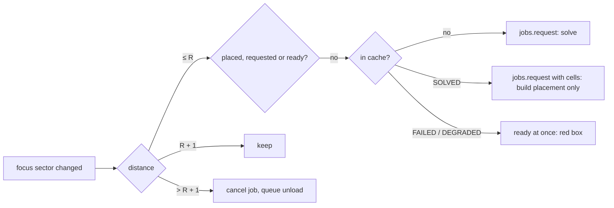

---
tags:
  - algorithm
  - streaming
  - placement
  - milestone/0.2.0
  - implemented
status: current
sources:
  - "[[godot-docs-multimesh]]"
  - "[[godot-docs-thread-safe-apis]]"
---

# Sector Streaming

> [!summary]
> The world is too big to place at once, so the walk scene keeps only the
> sectors around the player. `SectorStreamer` loads every sector within
> radius R of the player's sector (R = 1 by default, 27 sectors; up to 3)
> and frees a sector only once it is more than R + 1 away. That extra ring
> is [[GLOSSARY#Hysteresis|hysteresis]]: walking along a boundary never
> loads and frees the same sectors over and over. Sectors are solved on
> worker threads ([[sector-jobs]]); an [[GLOSSARY#LRU cache|LRU cache]] of
> solved cells means a sector walked back into is placed without solving
> again. The main thread places at most one sector per frame and adds its
> collision in small [[GLOSSARY#Collision chunk|collision chunks]] within a
> [[GLOSSARY#Frame budget|frame budget]], because Jolt builds a trimesh on
> the main thread and a whole sector at once would stall the frame for
> 1.5 s (decision #175). Translucent [[GLOSSARY#Impostor|impostor]] boxes
> in each sector's skeleton type colour fill the ring just outside R, so
> the world does not end at the last placed sector. Walking 10 sectors in a
> straight line and back never leaves a hole under the player, memory
> returns to within 1.3 % of where it started, and no frame after the first
> placements took longer than 16 ms.

This is milestone 0.2.0 item E4 of [[RESEARCH_WFC]] section 7, following
its section 5 on streaming and LOD and [[MEGASTRUCTURE_CONCEPT]] section 5.
It places what [[sector-jobs]] solves, with the placement of [[placement]].
Code: [[placement]].

## Interface

```gdscript
var streamer := SectorStreamer.new()
add_child(streamer)                               # jobs: a SectorJobs, also in the tree
streamer.radius = 1                               # 0..3
streamer.start(jobs, TileLibrary.build(load("res://resources/tilesets/placeholder.tres")), seed)
# every frame:
streamer.focus_position = player.global_position
if not streamer.is_collision_ready_at(player.global_position):
	pass                                          # hold the player; WorldWalker does
```

`update()` runs from `_process`. The signals `sector_placed(sector, result)`
and `sector_unloaded(sector)` report what happened; `placed` maps each
placed sector to its node.

## The load and unload rule

Distances are [[GLOSSARY#Chebyshev distance|Chebyshev distances]] in sector
units, `max(|dx|, |dy|, |dz|)`, from the focus sector, the sector the
player's feet are in.

| Distance | What happens |
| --- | --- |
| ≤ R | Wanted. Placed, or requested from the jobs, or taken from the cache. |
| R + 1 | Kept. A placed sector stays; nothing new is requested; its impostor box shows. |
| > R + 1 | Freed. Its node, body and impostor go; a queued job is dropped and a running one cancelled; a result arriving for it is discarded (still cached). |

The rule is evaluated only when the focus sector changes (or R does), in
`_refresh`: for R = 1 that is the (2 R + 3)³ = 125 sectors around the
focus, 343 at R = 3.



Walking in a straight line along +x with R = 1, crossing into sector
x + 1 requests the 3 × 3 slab at x + 2 and queues the slab at x − 2 for
freeing; the slab at x − 1 stays. The player's new sector and its six face
neighbours were all within R of the sector it came from except the one
ahead, so the only sector that can be missing on arrival is the one in front
of the player, and `WorldWalker` holds the capsule until the collision
around its feet is there (below).

## The LRU cache

`SectorStreamer` keeps the last `cache_size` (256) results by sector:
outcome, solved cells, the degraded flag and the error. Insertion order of a
GDScript `Dictionary` is the recency order: a hit erases and re-inserts the
entry, and eviction removes the first key.

- **What is cached is the cells, not the placement data.** A mixed sector's
  collision triangles are about 300 000 triangles, 11 MB as a
  `PackedVector3Array`; its cells are 13 824 32-bit integers, 55 KB. 256
  cached sectors cost 14 MB instead of 2.8 GB, and memory still returns to
  its baseline after a walk (decision #177).
- **A cached SOLVED sector is requested with its cells**
  (`SectorJobs.request(sector, cells)`), so its worker skips the pipeline
  and only runs `SectorMultiMesh.build`: 44 to 233 ms on a worker instead
  of seconds of solving. `SectorJobs.place_solved` builds that result.
- **A cached FAILED or DEGRADED sector** needs no worker at all: its red box
  is placed from the cache in the next frame.
- **With `use_gridmap`** a cached SOLVED sector is also ready at once;
  GridMap placement reads the cells on the main thread.

## The collision cook strategy

Jolt builds a `ConcavePolygonShape3D` on the main thread when the shape
first meets a body in a space, about 5 µs per triangle. Measured with
`mise run collision-cook-bench` on sector (-1, 1, -1) at seed 0 (286 108
triangles, 512 chunks of 3³ cells with at most 1368 triangles each):

| Strategy | Bodies | Main thread, placing to the end of the frame after | Longest frame | Freeing |
| --- | ---: | ---: | ---: | ---: |
| merged (what #96 shipped) | 1 | 1446 to 1457 ms | 1446 to 1457 ms | 0.3 ms |
| merged, through `PhysicsServer3D` | 1 | 1401 to 1439 ms | 1401 to 1439 ms | 4.9 to 5.0 ms |
| shape created on a worker thread | 1 | 1439 to 1448 ms | 1439 to 1448 ms | 4.2 to 5.1 ms |
| one body per chunk, one per frame | 512 | 8539 to 8540 ms | 5.1 to 5.5 ms | 8.0 to 8.1 ms |
| chunks as shapes of one body, one per frame | 1 | 8533 ms | 7.6 ms | 6.7 to 7.0 ms |
| **chunks as shapes of 8 bodies, one per frame (shipped)** | 8 | 8533 ms | 5.0 to 5.3 ms | 7.8 ms |

Two runs each, headless with the frame pacing sleep off; the chunked rows
take 8.5 s only because the bench waits for a physics frame (60 per second)
after every chunk, the work itself is about 1.2 s. Rays cast down through
all 576 columns hit the same heights within 1 mm for every strategy (off
the cell edges: a ray exactly on the edge two triangles share can report
either).

- **Building the shape off the main thread does not work** through the
  public API. `PhysicsServer3D` is wrapped in `PhysicsServer3DWrapMT`: a
  call from any thread but the server's is queued and run on the main
  thread, and `space_get_direct_state` refuses other threads. A shape
  created and filled on a worker still builds when its body enters the
  space, on the main thread. Running physics on its own thread
  (`physics/3d/run_on_separate_thread`) would move the build to the
  physics thread; that changes every scene and is not tried here.
- **Chunks** make the same triangles into many small shapes. Jolt's cost
  per shape stays at a few milliseconds and the total, 1.2 s of main-thread
  work per mixed sector, is spread over frames. The streaming placement
  data carries its triangles per chunk (`SectorMultiMesh.build(..., 3)`), so
  the worker does the sorting.
- **Eight bodies per sector, not one per chunk.** 36 sectors of 512 chunk
  bodies ran into Jolt's default body limit (10 240) in the first test run.
  `add_collision_chunk` adds each chunk as a shape of one of the sector's
  `BODY_BLOCKS`³ = 8 static bodies (one per 12³-cell octant) through
  `PhysicsServer3D`, no nodes. Jolt rebuilds a body's compound shape when a
  shape is added and optimises it again in the next physics step; with all
  512 shapes on one body that step reached 7.6 ms in the streaming walk, so
  the chunks are spread over 8 bodies of 64 shapes each. At R = 3 with its
  hysteresis ring that is at most 729 × 8 = 5832 bodies.
- **Freeing** a sector's bodies removes its collision at once; its 512
  shapes are freed a quarter budget per frame afterwards, because freeing
  them together took 6 ms.

Collision behaviour is that of the merged shape: a tile's triangles never
leave its cell, so the chunks together are exactly the merged faces, and
the per-shape internal edges fall on cell boundaries, where sector borders
already have them.

## The frame budget

`update()` does, in this order, each step only while the time spent since
the start of the update is under `frame_budget_usec` (6 ms). An item that
starts under budget finishes, so a frame can run over by one item, and a
refresh frame (rare) may skip the rest:

1. **Refresh** when the focus sector changed: cancel jobs, queue unloads,
   list the missing impostor boxes, request or take from the cache (up to
   2.1 ms at a crossing with R = 1).
2. **Free** queued chunk shapes for a quarter of the budget, then **at most
   one sector**: its bodies, its node (deleted at the end of the frame,
   outside the budget, which is why only one) and its impostor.
3. **Place** the ready result nearest to the focus sector: **at most one
   sector per frame**. A `SectorMultiMesh` is one `MultiMeshInstance3D`
   per tile mesh (up to 19), 3 ms.
4. **Add collision**: first the 27 chunks around the focus (sampled at the
   focus plus and minus one chunk edge on each axis), whatever sector they
   are in; then the nearest sector with missing chunks, its chunks sorted
   by distance to the focus when it was placed (one native sort of 64-bit
   keys, squared distance above the index).
5. **Make impostor boxes**, nearest first. Making 25 at once in the refresh
   took up to 9 ms.

The `SectorJobs` poll runs separately and stays under 1 ms.

**Holding the player.** `is_collision_ready_at(position)` is true when the
27 chunks around a position all have their shapes (or have no triangles, or
belong to a failed sector). While it is false, `WorldWalker` stops the
capsule's physics process: a player who walks faster than sectors load
stands at the edge instead of falling through a sector still being placed
(decision #178).

## Impostors and visibility ranges

Every sector within R + 1 has a `MeshInstance3D` box 44 m wide in its
skeleton type colour (`SkeletonViewer.TYPE_COLORS`, the skeleton viewer's
translucent fills): the type is one hash lookup (`Skeleton.sector_type`), so
the box is there before the sector is solved.

- **Not placed:** `visibility_range_begin` = 41.6 m (half the sector
  diagonal): the box hides when the camera is inside it or at its edge, so
  it never fills the view, and shows otherwise. Sectors within R still
  being solved show as boxes too, which reads as loading.
- **Placed MultiMesh sector:** its box's `visibility_range_begin` becomes
  `impostor_distance()`, (R + 0.5) × 48 × √3 + 12 m (136.7 m at R = 1): the
  farthest a sector within R can be from a camera inside the focus sector.
  Every `MultiMeshInstance3D` of the sector names the box as its
  `visibility_parent`, so the tiles show only while the box is hidden by
  its range. From farther away, as the free-fly camera can be, the box
  replaces the tiles.
- **Placed failed sector:** the red box is shown instead and the impostor
  hidden.
- `show_impostors` sets the boxes' `transparency` to 1 rather than hiding
  them, so the visibility parent keeps working.

Visibility ranges are measured from the camera to the centre of the node's
bounds ([[RESEARCH_WFC]] section 5); fog does the rest.

## Determinism of unload and regenerate

A sector is a pure function of the world seed and its coordinates: its type
from the hash, its records from the walkable graph, its cells from the
solver with solve seed = world seed ([[sector-solver]], [[integer-hash]]).
Nothing a player does changes it yet. So:

- **Unloading loses nothing.** The node, bodies and shapes are freed; the
  cache keeps only a shortcut.
- **A sector evicted from the cache and walked into again is solved again
  and comes out byte for byte the same.** `jobs-check` already shows
  worker results equal to the main-thread solve. The order of solving does
  not matter: each sector is solved from its own coordinates, and the
  portals it must meet come from the walkable graph, which gives both
  sectors of a face the same answer ([[edge-rasteriser]],
  [[face-first-boundaries]] for the boundary solve).
- **A sector from the cache is placed from exactly the cells it was solved
  to,** so it looks the same as when it was first placed.
- **Cancellation is safe:** a sector that leaves the ring while its job
  runs has its result discarded; asked for again later, it is solved anew
  with the same result.

## Measurements

`mise run streaming-check` (seed 0, R = 1, 8 tasks in flight, i9-9880H with
8 cores and 16 threads, another worker's checks running) walks a frozen
capsule 4 m per step along +x through the centres of sectors (x, 0, 0): a
warm-up to sector 1 and back sets the baseline with the hysteresis slab
loaded, then out to sector 10 and back. A step waits until everything
within R is placed and the collision around the next position is there.

| Measure | Result |
| --- | --- |
| First placements, 27 sectors (19 solved, all collision added) | 19.4 s |
| A crossing on the way out (9 sectors solved and placed) | 7 to 10 s |
| A crossing on the way back (9 sectors from the cache) | 0.5 to 1.1 s |
| Whole run (warm-up, 10 out, 10 back, settle) | 129 s |
| Frames without the player's sector or its collision | 0 of 144 072 |
| Steps missing a face neighbour or a sector within R, or keeping one beyond R + 1 | 0 |
| Solves on the way back | 0 (81 cache hits) |
| Sectors placed, freed | 198, 162 |
| Static memory, baseline and after walking back | 277.8 MB, 281.4 MB (+1.3 %) |
| Objects, nodes | 2490 and 482, both unchanged |
| Longest frame after the first placements | 15.2 ms; 0 frames over 16 ms |
| Longest streamer update, refresh, placement, unload | 13.3, 2.1, 3.2, 2.0 ms |
| Longest `SectorJobs` poll | 0.5 ms |

The timeline (one row per sector boundary crossed; `+placed` and `-freed`
count since the row before, `collision pending` the placed sectors still
missing chunks):

| t (s) | Event | Player sector | Placed | +placed | -freed | Solved | Cache hits | Collision pending |
| ---: | --- | --- | ---: | ---: | ---: | ---: | ---: | ---: |
| 19.4 | first placements done | (0, 0, 0) | 27 | 27 | 0 | 27 | 0 | 0 |
| 32.0 | baseline, after the warm-up | (0, 0, 0) | 36 | 9 | 0 | 36 | 0 | 0 |
| 39.9 | enter | (3, 0, 0) | 35 | 9 | 10 | 45 | 0 | 3 |
| 64.4 | enter | (6, 0, 0) | 35 | 9 | 9 | 72 | 0 | 5 |
| 100.0 | enter | (10, 0, 0) | 35 | 9 | 9 | 108 | 0 | 4 |
| 106.7 | enter | (9, 0, 0) | 36 | 9 | 8 | 117 | 0 | 2 |
| 109.0 | enter | (5, 0, 0) | 36 | 9 | 9 | 117 | 36 | 21 |
| 112.1 | enter | (0, 0, 0) | 35 | 8 | 9 | 117 | 81 | 22 |
| 128.9 | final | (0, 0, 0) | 36 | 9 | 8 | 117 | 81 | 0 |

- **Walking out is bound by solving**: a slab of 9 sectors takes 7 to 10 s
  on 8 tasks, so a player walking at 4 m/s (12 s per sector) keeps just
  ahead of it; running (8 m/s) is held at boundaries.
- **Walking back is bound by collision**: cached sectors are placed within
  a second, but their 1.2 s of chunk work each piles up (22 sectors pending
  on arrival); the chunks around the player always come first, so no step
  waited long. The last 17 s of the run are that backlog.
- **Memory**: the 1.3 % left over after walking back is the cache (117
  entries of about 55 KB each is 6.4 MB) and allocator slack; nodes and
  objects return exactly.
- **Frame times** were measured with the headless frame pacing sleep
  switched off, while another worker's checks kept the load average near 5.
  Before one unload per frame and budgeted impostor boxes, frames that freed
  6 to 8 sectors or made 25 impostor boxes at once reached 18 to 32 ms.

`--quick` (2 sectors out and back) takes about 55 s and gives the same
checks; the numbers above are from the full walk (`mise run
streaming-check`).

## Open questions

- **Cells or placement data in the cache** (#177): cells (55 KB) cost a
  worker build on re-entry; placement data (11 MB) would place at once.
- **Holding the player while collision loads** (#178): hold, slow down, or
  let it fall and respawn.
- **Collision cook cost** (#175): chunk shapes of one body per sector here;
  fewer triangles (option 3 there) would make every strategy cheaper, and
  physics on its own thread would take the build off the main thread.
- **Collision radius smaller than the view radius.** At R = 3 the streamer
  adds collision for up to 343 sectors that the player cannot reach soon;
  collision only for the sectors within 1 would cut the main-thread work.
- **Impostor shapes.** A box per sector; a box with slab lines or a merge of
  the solid cells ([[RESEARCH_WFC]] section 5) would read better from afar.

## References

- [[RESEARCH_WFC]], section 5 (streaming, LOD and impostors) and section 7
  (E4).
- [[MEGASTRUCTURE_CONCEPT]], section 5: load within R, unload beyond R + 1,
  impostors beyond about 2 sectors.
- [[sector-jobs]]: the tasks that solve and build placement data.
- [[placement]]: `SectorMultiMesh`, the chunked collision and the walk
  scene.
- [[godot-docs-multimesh]] and [[godot-docs-thread-safe-apis]].
- Code: [[placement]], [[tools-and-tasks]].
