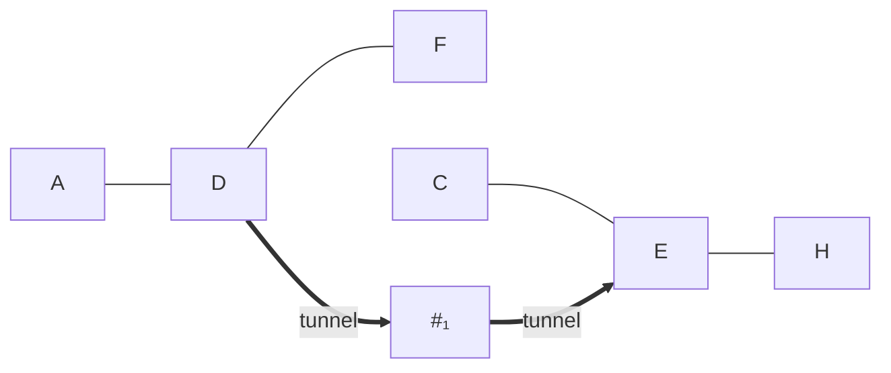
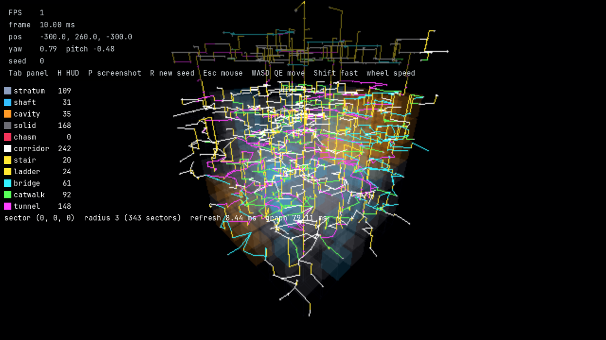
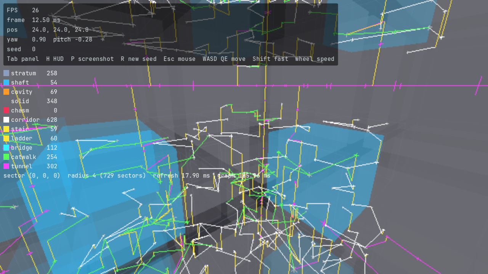

---
tags:
  - algorithm
  - graph
  - milestone/0.2.0
  - implemented
status: current
sources:
  - "[[newgas-2021-infinite-modifying-in-blocks]]"
  - "[[merrell-2007-example-based-model-synthesis]]"
---

# Walkable Graph Connectivity

> [!summary]
> The [[GLOSSARY#Walkable graph|walkable graph]] has to promise that the
> player can walk from any open sector to any other, but no piece of the
> world can see the whole world. So the edges are decided in small
> **regions** of 3 × 3 × 3 sectors. Inside a region,
> [[GLOSSARY#Kruskal's algorithm|Kruskal's algorithm]] with hashed weights
> picks a [[GLOSSARY#Spanning tree|spanning tree]]: cheap corridors first,
> expensive stairs later, and only when nothing else works a
> [[GLOSSARY#Tunnel edge|tunnel edge]] that carves through solid rock.
> Between two neighbouring regions a few [[GLOSSARY#Boundary edge|boundary
> edges]] stitch the trees together. Tunnels that open a chasm or cavity
> wall come after every other tunnel, so the chasms stay mostly sheer. A few hashed loop edges keep the maze
> from being a pure tree. Every choice is a hash of the seed and
> coordinates, so any sector gets the same edges no matter where you start
> generating.

The *why* (tunnels instead of counting components per open boundary, which
windows the check can promise) is in
[[0017-region-spanning-trees-with-tunnels]]. This note is the *how*. The
points the edges join (portals and interior nodes) are described in
[[sector-skeleton-and-walkable-graph#Nodes and portals]].

## The problem

- **Everything open must be reachable.** [[MEGASTRUCTURE_CONCEPT]] section
  2.2 asks that all non-solid sectors of a loaded area are connected.
- **Solid separates on purpose.** The tuned grammar
  ([[0016-tuned-sector-grammar-solid-before-voids]]) splits a 5³ window into
  2.4 open components on average. No graph over open sectors alone can join
  them.
- **Local and order-free.** A sector must get its edges from `(seed,
  sector)` without reading other sectors' edges, like the faces in
  [[model-synthesis-and-sectors]] and the blocks of
  [[newgas-2021-infinite-modifying-in-blocks]]. A global minimum spanning
  tree would be unique but cannot be computed locally.
- **Blame!-style travel.** Mostly horizontal walking; vertical edges rare,
  stacked in one column where possible, preferring shafts.

## The algorithm step by step

Region `R = floor(sector / 3)` covers sectors `3R` to `3R + 2` on each axis.

### 1. Classify and weigh every adjacent pair

For each pair of face-adjacent sectors `a` (lower) and `b = a + axis`:

**Edge kind** from the two sector types and the axis:

| Condition (first match) | Kind |
| --- | --- |
| either sector is solid | tunnel |
| axis y, both shaft or chasm | ladder |
| axis y, otherwise | stair |
| either is cavity or chasm | bridge |
| either is shaft | catwalk |
| otherwise (stratum-stratum) | corridor |

**Weight** = `class << 32 | hash`, a 64-bit integer, so the class always
decides first and the 32-bit hash only orders edges inside a class:

| Class | Pair |
| ---: | --- |
| 0 | horizontal, both open |
| 1 | vertical, both shaft or chasm (the cheapest way up) |
| 2 | vertical, both open otherwise |
| 3 | horizontal, one solid |
| 4 | horizontal, both solid |
| 5 | vertical, one solid |
| 6 | vertical, both solid |
| 7 | horizontal, one solid, the other a cavity or chasm |
| 8 | vertical, one solid, the other a cavity or chasm |

Classes 7 and 8 apply when `void_wall_tunnels_last` is on, the default;
with it off such pairs stay in class 3 or 5. A tunnel from a chasm or cavity
into solid is a hole in its wall, a facade opening, so the tree drills from
strata and shafts first and opens a void's wall only where the void has no
other way out. Open pairs keep their classes, so this changes which tunnels
are built, never whether an open path is preferred.
A horizontal hash is keyed on `a` (salt 153 for x, 155 for z). A vertical
hash is keyed on the **column run** `(a.x, floor(a.y / 9), a.z)` with salt
154. All stacked vertical pairs of a column within 9 sectors weigh the same,
so when Kruskal needs to climb it takes the whole cheapest column. That
makes vertical edges stack into ladders and stairwells instead of scattering.

### 2. Boundary edges between regions

For regions `R` and `R + axis`, the face holds 3 × 3 = 9 sector pairs.
`boundary_edges(R, axis)`, keyed on the lower region, keeps:

- the **lightest** pair by the weight above, when the boundary scheme keeps
  the face. Open-open pairs come first, then one-solid, then both-solid, so
  a kept face gets exactly one such edge and it tunnels only when the face
  has no open-open pair;
- every other open-open pair whose loop hash passes (step 5).

Each face has a **class**: *open* (some pair is open on both sides), *wall*
(no open-open pair, but some of its 18 sectors is non-solid) or *solid*
(all 18 solid). `boundary_scheme` decides which faces are kept:

| Scheme | Kept unconditionally | Kept when a block tree needs it |
| --- | --- | --- |
| `PER_FACE` (default) | every face | none |
| `PER_REGION_PAIR` | open faces | wall and solid faces |
| `SKIP_SOLID_FACES` | open and wall faces | solid faces |

A **block** is 2 × 2 × 2 regions. A face between `R` and `R + axis` lies in
four blocks, one per choice of offset −1 or 0 along the two other axes. The
**block tree** of a block is Kruskal over its 8 regions and 12 faces: the
unconditional faces join first, the others follow by the weight of their
lightest pair, then by region index and axis. The tree spans all 8 regions,
solid ones included, and is not pruned. A conditional face is kept when the
tree of any of its four blocks takes it. This is the
region-level spanning structure: a wall or solid face tunnels only when the
open faces around it do not already join the two regions inside every block
they share.

Only sector types are read, never another region's edges, so both regions
get the same answer. A conditional face reads the face classes of the 33
faces of its four blocks; the graph memoises face classes per instance.

### 3. Terminals

The **terminals** of `R` are its non-solid sectors, plus the sectors of `R`
that a boundary edge on any of its six faces lands on. A boundary tunnel can
land on a solid sector; making it a terminal forces the region's tree to
reach it, so the tunnel does not end in the rock.

### 4. Kruskal and pruning

1. List the 54 adjacent pairs inside `R` (18 per axis) with their weights.
2. Sort by weight, then by sector index and axis, so ties break the same
   way everywhere.
3. Take pairs in order and keep one when [[GLOSSARY#Union-find|union-find]]
   says its sectors are in different groups. The result spans all 27
   sectors, solid ones included.
4. **Prune**: repeatedly drop an edge whose leaf end is not a terminal. What
   remains is the subtree joining the terminals.

Every open-open pair (classes 0 to 2) comes before every tunnel (3 to 6).
So by the time Kruskal looks at a tunnel, all open sectors that are joined
through open sectors inside the region are already in one group. A tunnel
is kept only to join groups that no open path inside the region joins.
Solid sectors that Kruskal attached along the way end up as leaves and are
pruned.

### 5. Loops

Every open-open pair of the region that is not in the tree gets an edge
when `hash3(seed, a, salt)` < 0.08 horizontally (salts 156, 158) or < 0.02
vertically (157). Tunnels never come back as loops.

### 6. Queries

- `edges_in_region(R)`: the tree and loop edges of step 4 and 5, ordered by
  `a` and axis.
- `boundary_edges(R, axis)`: step 2.
- `edges_for_sector(s)`: the edges of `s`'s region touching `s`, plus the
  boundary edges of that region's faces that land on `s`.

Every `Edge` carries `a`, `b`, `axis`, `kind` and a `portal`, the
[[GLOSSARY#Portal|portal]] point on the face. On a y face both coordinates
are hashed (salts 142, 143); on an x or z face the coordinate along the face
is hashed (salt 141 or 144) and the height is the floor level of `a`'s hub,
the level of its interior node or, for a solid `a`, the centre level of 12
cells. So every horizontal edge is level in `a` and changes height only in
`b` ([[sector-skeleton-and-walkable-graph#Nodes and portals]]). Tunnel edges
get the same point, although `portal(a, b)` returns null for solid pairs. It
gives the fill layer a place to carve the corridor through.

## Worked example

One horizontal layer of a region (y fixed), `#` is solid:

```
 z=2   A  #  C
 z=1   D  #  E
 z=0   F  #  H
      x=0 x=1 x=2
```

The candidates within this layer are A–D, D–F (open, class 0), C–E, E–H
(open, class 0), and the six pairs touching the solid column (class 3 or 4).
Kruskal takes the four open edges first, which leaves two groups {A, D, F}
and {C, E, H}. Assume the other layers of the region have no open path
between the groups either. The cheapest tunnel pairs now come in order of
their hash, say D–#₁, #₁–E (with `#₁` the solid sector at x=1, z=1), then
#₀–F, and so on. D–#₁ joins #₁ to the left group, #₁–E joins the two groups,
and #₀–F only adds a solid leaf. Pruning removes #₀–F and every other edge
ending in a solid leaf, and the result is:



If a boundary edge on the region's lower `z` face had tunnelled into `#₀`
instead, `#₀` would be a terminal and #₀–F would stay.

## Connectivity guarantee

**Claim.** With `PER_FACE`, for any set of regions that is connected through
shared faces, the edges inside those regions plus the boundary edges between
them connect all non-solid sectors of the set. With `PER_REGION_PAIR` and
`SKIP_SOLID_FACES` the same holds for a single region and for every box of
regions at least 2 regions long on each axis.

**Argument.** Each region's pruned tree connects all its terminals, and all
its edges lie inside the region. Each kept face has a boundary edge, and
both of its ends are terminals of their regions (step 3). With `PER_FACE`
every shared face is kept, so walking region to region along faces reaches
every terminal, and all open sectors are terminals. With the other schemes,
take a box of regions at least 2 long on each axis: every 2³ block inside
it has a block tree that joins all 8 of its regions with kept faces, and
neighbouring blocks inside the box share 4 regions, so every region of the
box is reached. A slab or line one region thick can lose a face no block
inside it supplies. Pruning solid regions out of the block trees would save
a few tunnels but break this: two blocks overlapping only in solid regions
would no longer join.

Hence every window made of whole regions, such as 3³ sectors (one region),
6³ sectors (2 × 2 × 2 regions) or 9³ sectors (3 × 3 × 3), has exactly one component of non-solid
sectors when only edges with both ends in the window count.
`mise run graph-connectivity` checks exactly this, for every variant.

**Windows that cut regions** have no such guarantee. An open sector near a
window edge may reach the rest only through a tree path that leaves the
window. Measured over 5³ windows at every offset of a 15³ sample, seeds 0
to 9 (13 310 windows):

| Edge set | Windows with one component |
| --- | ---: |
| this graph (default) | 470 (3.5 %) |
| `PER_FACE` without `void_wall_tunnels_last` | 481 (3.6 %) |
| `PER_REGION_PAIR` | 352 (2.6 %) |
| every open-open adjacency, no tunnels | 3 441 (25.9 %) |

Even the densest graph without tunnels joins only a quarter of the windows,
because the grammar separates them. A graph that joins every 5³ window would
need tunnels wherever any window's open parts are split, which is almost
everywhere.

## Measured shape

Seeds 0 to 9, the same 15³ samples, 26 434 edges (region edges plus the
boundary edges between the sample's regions), default graph:

| Kind | Share |
| --- | ---: |
| corridor | 51.6 % |
| catwalk | 14.8 % |
| tunnel | 14.0 % |
| bridge | 10.3 % |
| stair | 5.4 % |
| ladder | 3.9 % |

Stair and ladder edges form 1 206 vertical runs, 2.04 sectors (about 98 m)
long on average.

## Boundary schemes and tunnel weights, measured

Issue #129: chasm sectors showed many tunnels into their walls. Chasms are
rare (a 2 % chance per 32 × 96 sector band), so none of the random samples
holds one; `mise run graph-connectivity` also takes, per seed, a 15³ sample
centred on the lower x wall of the first chasm along +x. The variants,
seeds 0 to 9, 125 regions per sample:

| Variant | Sample | Edges | Tunnels | Chasm-end tunnels | Cavity-end tunnels | Faces skipped | Split aligned windows (3³, 6³, 9³) | Vertical run |
| --- | --- | ---: | ---: | ---: | ---: | ---: | ---: | ---: |
| `PER_FACE` (before) | random | 26 151 | 13.0 % | 0 | 324 | 0 | 0 of 2 160 | 2.04 |
| | chasm | 30 944 | 6.1 % | 83 | 96 | 0 | 0 of 2 160 | 2.64 |
| `PER_REGION_PAIR` | random | 25 021 | 9.1 % | 0 | 225 | 396 of 3 000 | 0 | 2.04 |
| | chasm | 30 299 | 4.1 % | 72 | 64 | 186 | 0 | 2.64 |
| `SKIP_SOLID_FACES` | random | 26 055 | 12.7 % | 0 | 319 | 13 | 0 | 2.04 |
| | chasm | 30 922 | 6.0 % | 83 | 95 | 3 | 0 | 2.64 |
| `PER_FACE` + void walls last (**default**) | random | 26 434 | 14.0 % | 0 | 42 | 0 | 0 | 2.04 |
| | chasm | 31 091 | 6.6 % | 63 | 9 | 0 | 0 | 2.64 |
| `PER_REGION_PAIR` + void walls last | random | 25 176 | 9.7 % | 0 | 32 | 394 | 0 | 2.04 |
| | chasm | 30 394 | 4.4 % | 50 | 7 | 189 | 0 | 2.64 |

What the numbers say:

- **Most void-wall tunnels are inside regions, not on faces.** Of the 179
  chasm or cavity tunnels in the chasm samples under `PER_FACE`, 37 lie on
  boundary faces. A chasm column cut off from the rest of its region by
  solid needs a tunnel for the 3³ guarantee whatever the boundary scheme.
- **`PER_REGION_PAIR`** removes the most tunnels (13.0 → 9.1 %) but only
  11 of 83 chasm tunnels, skips 13 % of faces, narrows the guarantee to
  boxes at least 2 regions thick and joins fewer strict 5³ windows.
- **`SKIP_SOLID_FACES`** hardly changes anything: faces solid on both sides
  are rare (13 of 3 000).
- **Void walls last** keeps every face and the guarantee, and moves tunnels
  off void walls: chasm-end tunnels 83 → 63, cavity-end 96 → 9, on boundary
  faces 37 → 4. The price is 1 point more tunnels, as the tree now drills
  around a void through more solid.

Vertical runs are identical everywhere: no variant changes open edges.
Owner decision on the scheme: issue #135.

## Complexity

- `boundary_edges`: 18 `sector_type` calls and 9 weights, constant. A
  conditional face under `PER_REGION_PAIR` or `SKIP_SOLID_FACES` adds four
  block trees over 12 faces each: up to 33 face classes, memoised per
  graph (dropped past 100 000 faces).
- `edges_in_region`: 27 sector types, six boundary faces (108 types), 54
  candidates sorted, near-constant union-find and a pruning pass over at
  most 26 tree edges. Constant per region, about 250 `sector_type` calls.
- `edges_for_sector`: one region plus up to three faces.
- The check (5 variants, 10 seeds, two samples of 125 regions each, 13 310
  strict and 2 160 aligned windows per random sample) runs in about 2 min
  headless on a caching skeleton; `--variants=` picks some.

Only face classes are memoised, so a caller that
streams sectors should cache edges per region.

## Determinism

Every input is `(seed, coordinates)`: sector types come from the pure
grammar, weights and loops from [[integer-hash]] draws keyed on the lower
sector or its column run, and boundary edges on the lower region. Sorting
uses a total order (weight, index, axis) and union-find visits candidates in
that order, so the result never depends on call order, on the caller's
sector or on which neighbours exist. Integer weights avoid float ties
entirely. `mise run graph-connectivity` compares every region against a
fresh `WalkableGraph`.

## Parameters and salts

Constants in [walkable_graph.gd](../../scripts/world/walkable_graph.gd):

| Constant | Value | Meaning |
| --- | ---: | --- |
| `REGION_SECTORS` | 3 | sectors per region edge |
| `VERTICAL_RUN_SECTORS` | 9 | height of a column run sharing one vertical weight |
| `LOOP_PROBABILITY_HORIZONTAL` | 0.08 | chance of a horizontal loop edge |
| `LOOP_PROBABILITY_VERTICAL` | 0.02 | chance of a vertical loop edge |
| `boundary_scheme` | `PER_FACE` | which region faces get their lightest pair (step 2) |
| `void_wall_tunnels_last` | true | tunnels with a cavity or chasm end take classes 7 and 8 |

`boundary_scheme` and `void_wall_tunnels_last` are properties of a
`WalkableGraph` and arguments 3 and 4 of `WalkableGraph.new`; the skeleton
viewer's `graph` panel section sets them for the drawn graph.

| Salt | Key | Decides |
| ---: | --- | --- |
| 153 | lower sector of an x pair | x edge weight |
| 154 | `(x, floor(y / 9), z)` of the lower sector | y edge weight, shared by the column run |
| 155 | lower sector of a z pair | z edge weight |
| 156 | lower sector of an x pair | x loop edge |
| 157 | same for y | y loop edge |
| 158 | same for z | z loop edge |

Boundary edges reuse salts 153 to 158, so a pair weighs the same whether
it lies inside a region or on a face. Salt 159 is still free. Salt 903 is
used only by the connectivity check to place its samples.

## Open questions

- Tunnels are decided per region, so two open sectors joined through a
  neighbouring region may still get a tunnel inside their own region. This
  is where most chasm tunnels come from; no boundary scheme removes them
  without giving up the 3³ window guarantee. Tunnels are 14 % of edges; a
  later pass could share this with the rasteriser's cost.
- The boundary scheme is the owner's call (#135); the measured variants are
  above.
- Vertical runs average 2 sectors. Longer runs would need the boundary
  choice to follow the column run across regions more strongly.

## References

- Kruskal 1956, On the Shortest Spanning Subtree of a Graph and the
  Traveling Salesman Problem.
- [[newgas-2021-infinite-modifying-in-blocks]]: fixed blocks decided from
  the seed, the local and order-free scheme regions follow.
- [[merrell-2007-example-based-model-synthesis]]: solving in blocks with
  fixed boundaries.
- [[RESEARCH_WFC]], section 7, B2; [[MEGASTRUCTURE_CONCEPT]], section 2.2.
- Glossary: [[GLOSSARY#Kruskal's algorithm]], [[GLOSSARY#Spanning tree]],
  [[GLOSSARY#Union-find]], [[GLOSSARY#Portal]], [[GLOSSARY#Walkable graph]],
  [[GLOSSARY#Region]], [[GLOSSARY#Boundary edge]], [[GLOSSARY#Tunnel edge]].
- Decision: [[0017-region-spanning-trees-with-tunnels]].
- Code: [[walkable-graph]].

## What it looks like





Both show the default graph (`PER_FACE`, void walls last). Corridors are
white, stairs and ladders yellow, bridges cyan, catwalks green
and tunnels magenta. Each half of an edge is drawn level at its node's floor
level to the point above or below the portal, and a yellow vertical segment
on the portal's side marks the height change, the end where the edge
rasteriser starts its stair run or ladder ([[walkable-graph#Debug lines]]).
Nothing is drawn as a slope, and horizontal edges have a vertical segment on
their upper side (`b`) only.

Both renders come from `mise run shot` on `scenes/skeleton_viewer.tscn` at
seed 0 with the HUD, 1280 × 720:

```sh
# Outside: the 7^3 region around the origin, pose of skeleton#Viewer.
mise run shot scenes/skeleton_viewer.tscn docs/images/walkable-graph-outside.png \
	--seed 0 --pose=-300,260,-300,0.79,-0.48 --params follow_camera=false,radius=3 --ui
# Inside: at the origin sector's centre, radius 4.
mise run shot scenes/skeleton_viewer.tscn docs/images/walkable-graph-inside.png \
	--seed 0 --pose 24,24,24,0.9,-0.28 --params radius=4 --ui
```
